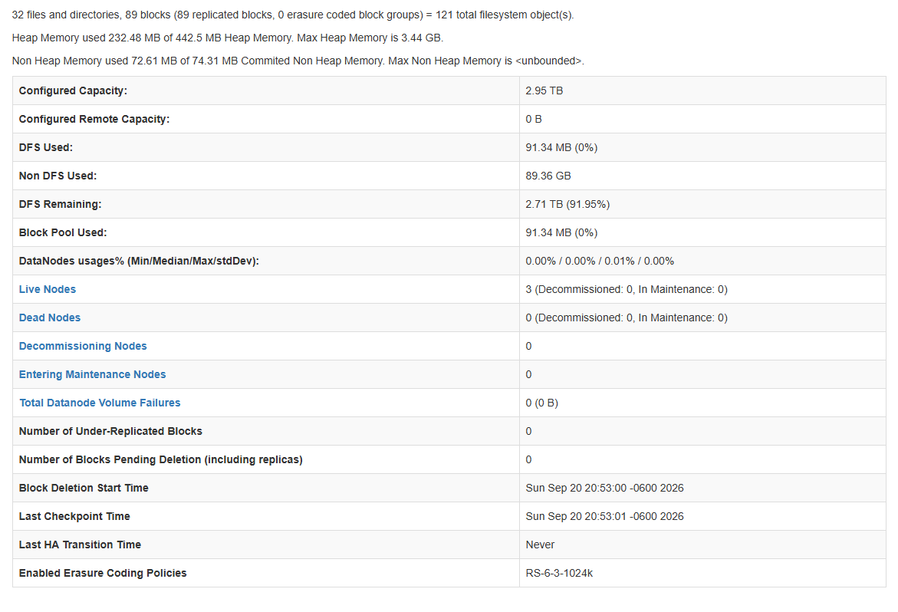
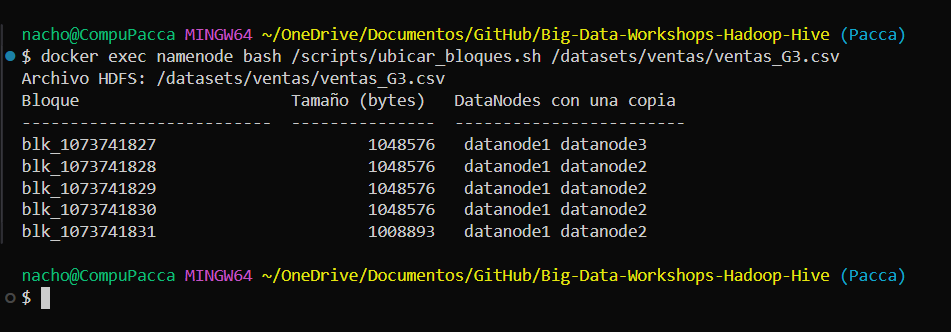
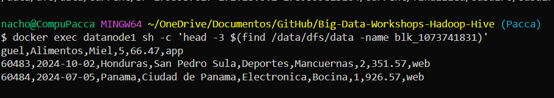
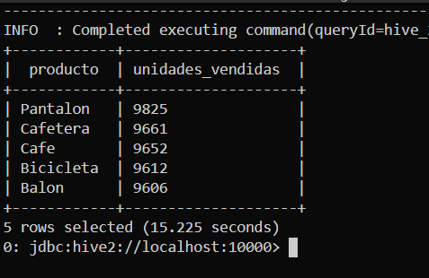
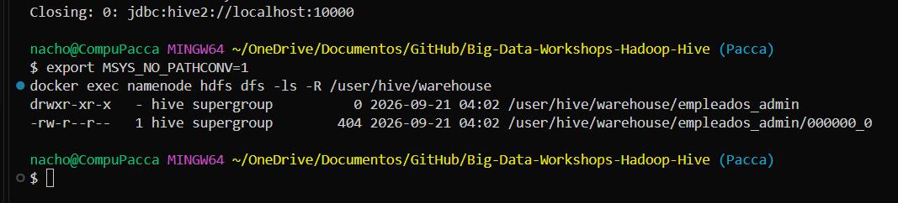
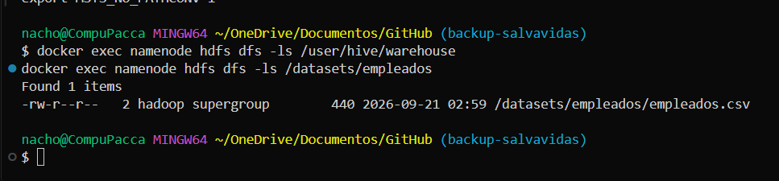
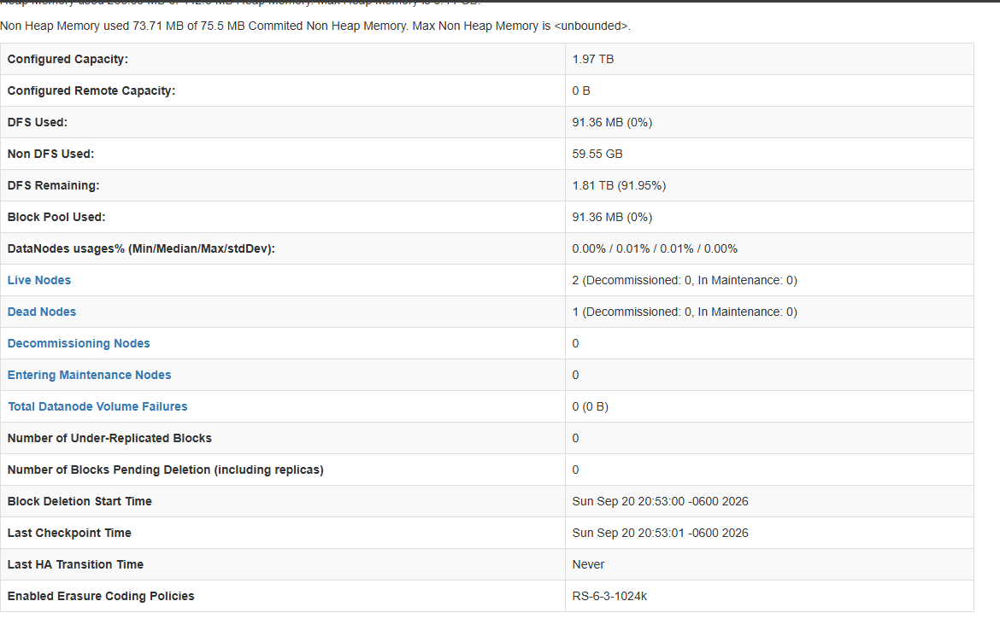
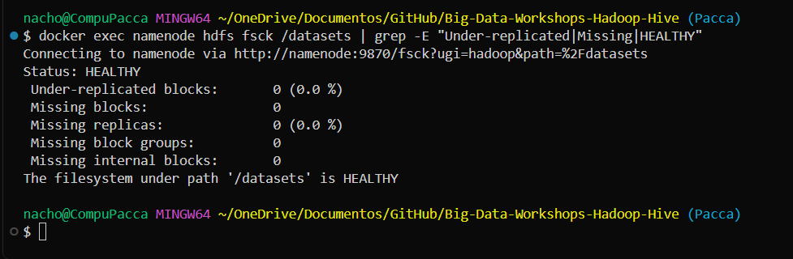

# Bitácora del taller Hadoop y Hive

- **Nombre:** Jose Ignacio Paccagnella
- **Carné:**20240103
- **Grupo:** G2
- **Mini-reto asignado al grupo:**  B 
- **Sistema operativo y chip de tu laptop:**  Windows 11

> Copia este archivo como `bitacora.md` dentro de tu carpeta de entrega y llena cada sección.
> Las capturas van en la carpeta `capturas/` y se enlazan desde aquí. Borra las líneas de ayuda en `>` antes de entregar.

## 1. Evidencias

> Cada captura debe verse completa, con el comando y su salida. Debajo de cada una escribe **una frase** con lo que muestra.

### E1. NameNode con 3 DataNodes vivos (Paso 10)



Lo que muestra:

### E2. Ubicación de los bloques del archivo de mi grupo (Paso 10)



Lo que muestra:

### E3. Un bloque físico dentro de un DataNode (Paso 4 o 10)



Lo que muestra:

### E4. Resultado de la consulta de negocio de mi grupo (Paso 8)



Lo que muestra:

### E5. Warehouse antes y después del `DROP` (Paso 9)




Lo que muestra:

### E6. Clúster con un DataNode apagado (Paso 11)




Lo que muestra:

## 2. Preguntas de comprensión

> 2 a 5 líneas por respuesta, con tus palabras y con lo que viste en tu máquina. No copies definiciones.

1. ¿Qué guarda el NameNode y qué guarda cada DataNode? Justifícalo con lo que encontraste dentro
   de los contenedores (qué archivos hay en `/data/dfs/name` y qué hay en `/data/dfs/data`).

   Namenode es pura metadata, indices, guarda la estrucutra de carptas, lso archviso qeu exsiten, como estan dividdios y en que datanode vive cada archivo. Con los archivos /data/dfs/name/current en el contenedor namenode, donde solo estaba fsimage y edits, ningun dato real. Datanode guarda lo sloques fisicamente en el disco, se podia ver en el datanode1 y las filas del csv.


2. Con tu salida de E2: ¿cuántos bloques tiene el archivo de tu grupo, en qué DataNodes está cada uno
   y por qué cada bloque aparece en dos nodos?

blk_1073741827   1048576   datanode1 datanode3
blk_1073741828   1048576   datanode1 datanode2
blk_1073741829   1048576   datanode1 datanode2
blk_1073741830   1048576   datanode1 datanode2
blk_1073741831   1008893   datanode1 datanode2

Aparece dos bloques por cada nodo por qeu asi lo congigrure en el hdfs-site.xml, cada nodo pesa 1048576 bytes y el ultimo es el resto por qeu asi se configuro, todos comparten el datanode1 por que fue le primer archivo que subi antes de datanode2 y 3 

   
3. ¿En qué se diferencia `hdfs dfs -ls /datasets` de `ls /datasets` dentro del contenedor?
   ¿Dónde están "de verdad" los bytes del archivo?

hdfs dfs -ls /datasets le pregunta al NameNode por su índice interno de HDFS, un namespace lógico que él administra. ls /datasets en cambio busca esa ruta directamente en el disco de Linux del contenedor, donde nunca existió como carpeta real, por eso da error. Los bytes reales del archivo no están en ninguna ruta llamada /datasets: están repartidos como bloques blk dentro de /data/dfs/data en cada DataNode, y el NameNode es el único que sabe qué lista de bloques reconstruye cada archivo.

4. ¿Qué pasó con los datos al hacer `DROP TABLE` de la tabla **externa** y qué pasó con los de la
   tabla **administrada**? ¿Por qué esa diferencia importa cuando varios equipos comparten un Data Lake?

Cuando hice DROP TABLE de la tabla externa empleados, solo se borró la definición en el catálogo de Hive. Comprobé que el archivo empleados.csv seguía intacto en /datasets/empleados/, sin ningún cambio. En cambio, cuando borré la tabla administrada empleados_admin, Hive sí borró la carpeta de datos completa en /user/hive/warehouse/, porque esa carpeta la había creado el propio Hive al hacer el CREATE TABLE AS SELECT. Esta diferencia es importante en un Data Lake compartido porque normalmente varios equipos o herramientas leen los mismos archivos. Si todas las tablas fueran administradas, cualquier equipo podría borrar sin querer datos que otro todavía necesita. Con tablas externas, cada equipo puede definir su propia tabla sobre los mismos archivos sin poner en riesgo los datos de los demás.

5. Al apagar `datanode2`: ¿pudiste seguir leyendo tu archivo? ¿Qué hizo el NameNode después de
   ~1 minuto? Relaciónalo con la **P** (tolerancia a particiones) del teorema CAP.

Cuando apagué datanode2, pude seguir leyendo el archivo de ventas completo sin ningún error, porque cada bloque que tenía copia ahí también tenía su segunda copia en otro nodo vivo. Después de esperar cerca de un minuto, el reporte del NameNode mostró el nodo como muerto, y al revisar la ubicación de los bloques vi que las copias que estaban en datanode2 ya habían sido recreadas automáticamente en datanode3, sin que yo hiciera nada manual. Esto es la P del teorema CAP en la práctica: el sistema tolera que una parte del clúster falle y sigue respondiendo sin interrupción, porque ya había replicado los datos por adelantado en previsión de justo esa falla.

6. El programa `WordCount.java` y la consulta de Hive dan el mismo resultado. ¿Qué gana y qué pierde
   un equipo que usa Hive en vez de escribir MapReduce a mano?

   Con Hive, escribí en una sola línea de SQL usando LATERAL VIEW explode lo mismo que WordCount.java hace en unas 60 líneas de código Java con clases Mapper y Reducer separadas. Eso significa que cualquiera que sepa SQL puede escribir y modificar consultas sin ser programador, y es mucho más rápido de mantener. Lo que se pierde es control fino sobre cómo se ejecuta el procesamiento por debajo: Hive decide automáticamente cómo traducir la consulta en fases de Map y Reduce, mientras que escribiendo MapReduce a mano uno controla exactamente qué hace cada paso, lo cual puede ser necesario para lógica muy específica que no se expresa bien en SQL.


## 3. Mini-reto del grupo

**Pregunta de negocio (reto B):**

Los 5 productos con más unidades vendidas. ¿Cuántas unidades vendió el primero?

**Consulta:**

```sql
SELECT producto, SUM(cantidad) AS unidades_vendidas
FROM ventas
GROUP BY producto
ORDER BY unidades_vendidas DESC
LIMIT 5;
```


**Resultado (pega la tabla que devolvió beeline):**
INFO  : Completed executing command(queryId=hive_20260921202409_9b2218eb-e47d-41cf-9e9e-7862b49b2cf7); Time taken: 11.676 seconds
+------------+--------------------+
|  producto  | unidades_vendidas  |
+------------+--------------------+
| Pantalon   | 9825               |
| Cafetera   | 9661               |
| Cafe       | 9652               |
| Bicicleta  | 9612               |
| Balon      | 9606               |
+------------+--------------------+
5 rows selected (15.225 seconds)

```

```

**Interpretación en una frase:**

## 4. Problemas que tuve y cómo los resolví (opcional)

>El producto más vendido en unidades fue Pantalón, con 9,825 unidades. La diferencia
con los siguientes cuatro productos es mínima.
