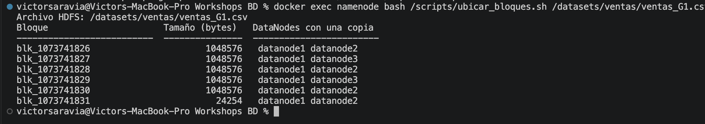
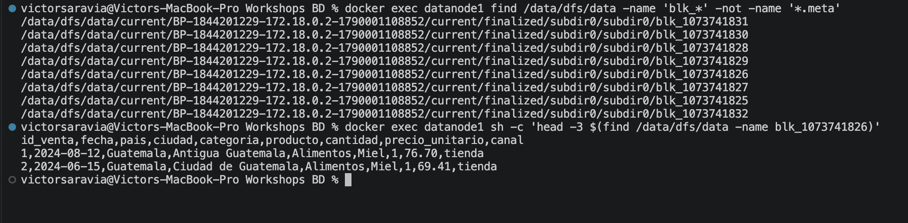
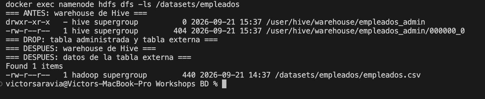

# Bitácora del taller Hadoop y Hive

- **Nombre:** Victor Saravia
- **Carné:** 20240060
- **Grupo:** G1
- **Mini-reto asignado al grupo:** A
- **Sistema operativo y chip de tu laptop:** macOS, Apple M4

## 1. Evidencias

### E1. NameNode con 3 DataNodes vivos

.png)
.png)

Lo que muestra: el Summary del NameNode llegó a tres nodos vivos después de iniciar datanode2 y datanode3.

### E2. Ubicación de los bloques del archivo de mi grupo



Lo que muestra: los seis bloques de ventas_G1.csv aparecen con dos ubicaciones, porque subimos la réplica a 2.

### E3. Un bloque físico dentro de un DataNode



Lo que muestra: los archivos `blk_...` están en `/data/dfs/data` de datanode1; al leer el primer bloque aparecen el encabezado y ventas reales del CSV.

### E4. Resultado de la consulta de negocio de mi grupo

.png)
.png)

Lo que muestra: la consulta del reto A suma las ventas por país. Guatemala quedó primero con 33,070,879.93.

### E5. Warehouse antes y después del `DROP`



Lo que muestra: `empleados_admin` existía en el warehouse; después del `DROP` su carpeta desapareció. El CSV de empleados siguió en `/datasets/empleados`.

### E6. Clúster con un DataNode apagado

.png)
.png)
.png)

Lo que muestra: con datanode2 detenido, el NameNode reportó dos nodos vivos y uno muerto. `fsck` siguió mostrando el sistema saludable y sin bloques perdidos.

## 2. Preguntas de comprensión

**1. ¿Qué guarda el NameNode y qué guarda cada DataNode?**

En `/data/dfs/name/current` del NameNode encontré `fsimage`, `edits`, `VERSION` y `seen_txid`: ahí está el índice de archivos, bloques y cambios. En `datanode1`, dentro de `/data/dfs/data`, encontré los archivos físicos `blk_...`. Por eso el NameNode sabe dónde está cada bloque, pero no guarda los bytes del CSV.

**2. Con tu salida de E2: ¿cuántos bloques tiene el archivo de tu grupo, en qué DataNodes está cada uno y por qué cada bloque aparece en dos nodos?**

Mi archivo `ventas_G1.csv` quedó dividido en seis bloques porque usamos bloques de 1 MB. En E2 cada bloque aparece en datanode1 y además en datanode2 o datanode3. Cada uno se ve dos veces porque configuramos `dfs.replication=2`, para que una caída no deje el bloque sin copia.

**3. ¿En qué se diferencia `hdfs dfs -ls /datasets` de `ls /datasets` dentro del contenedor? ¿Dónde están "de verdad" los bytes del archivo?**

`hdfs dfs -ls /datasets` consulta la ruta lógica que mantiene HDFS y mostró las carpetas de datos. `ls /datasets` buscó esa carpeta en Linux dentro del NameNode y respondió que no existía. Los bytes están en los archivos `blk_...` del disco de los DataNodes, no en una carpeta `/datasets` local.

**4. ¿Qué pasó con los datos al hacer `DROP TABLE` de la tabla externa y qué pasó con los de la administrada? ¿Por qué esa diferencia importa cuando varios equipos comparten un Data Lake?**

Al borrar `empleados_admin`, Hive borró su archivo del warehouse porque era una tabla administrada. Al borrar `empleados`, solo desapareció la definición de la tabla; `empleados.csv` continuó en HDFS. En un Data Lake eso evita que un equipo elimine los archivos compartidos solo por borrar su tabla o catálogo.

**5. Al apagar `datanode2`: ¿pudiste seguir leyendo tu archivo? ¿Qué hizo el NameNode después de ~1 minuto? Relaciónalo con la P del teorema CAP.**

Sí. Después de detener datanode2, el conteo del archivo todavía devolvió 75,001 líneas, incluyendo el encabezado. Cerca de un minuto después, el NameNode mostró dos nodos vivos y uno muerto; HDFS mantuvo el sistema saludable usando la otra réplica y reparó las copias necesarias. Eso muestra tolerancia a una partición o falla de nodo sin dejar de servir el archivo.

**6. `WordCount.java` y la consulta de Hive dan el mismo resultado. ¿Qué gana y qué pierde un equipo que usa Hive en vez de escribir MapReduce a mano?**

Con Hive el equipo gana rapidez: escribió SQL para obtener los conteos y el plan mostró Map y Reduce sin programar las clases Java. También es más fácil revisar consultas y definir tablas sobre CSV existentes. Se pierde control fino sobre el mapper, reducer, formatos y optimizaciones que sí se pueden ajustar directamente en un programa MapReduce.

## 3. Mini-reto del grupo

**Pregunta de negocio (reto A):** Ventas totales por país, ordenadas de mayor a menor. ¿Cuál país concentra más ventas?

**Consulta:**

```sql
SELECT pais,
       ROUND(SUM(cantidad * precio_unitario), 2) AS total_ventas
FROM ventas
GROUP BY pais
ORDER BY total_ventas DESC;
```

**Resultado:**

```
Guatemala    33070879.93
Honduras      30245158.73
Mexico        26893624.89
Costa Rica    20236844.05
El Salvador   13590161.66
Panama         3514714.55
```

**Interpretación en una frase:** Guatemala concentra el mayor total de ventas del archivo G1, con 33,070,879.93, por encima de Honduras y México.

## 4. Problemas que tuve y cómo los resolví

HiveServer2 no abría el puerto JDBC porque `/tmp/hive` en HDFS no era escribible para Hive. Se corrigieron los permisos de los directorios temporales del laboratorio y luego Hive pudo iniciar. También se ajustó la configuración del metastore de Hive 4 para que la tabla de comparación apareciera como administrada.
