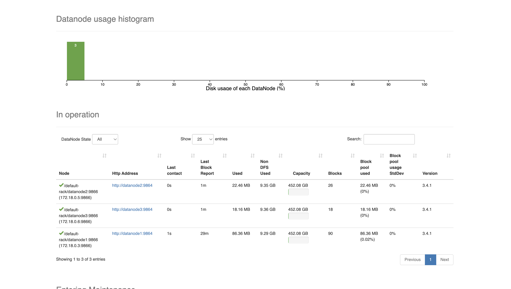
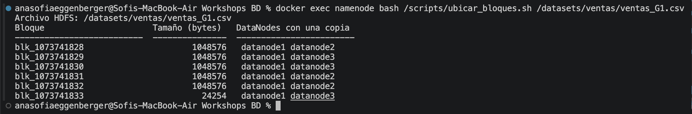
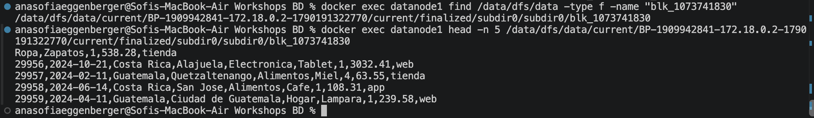
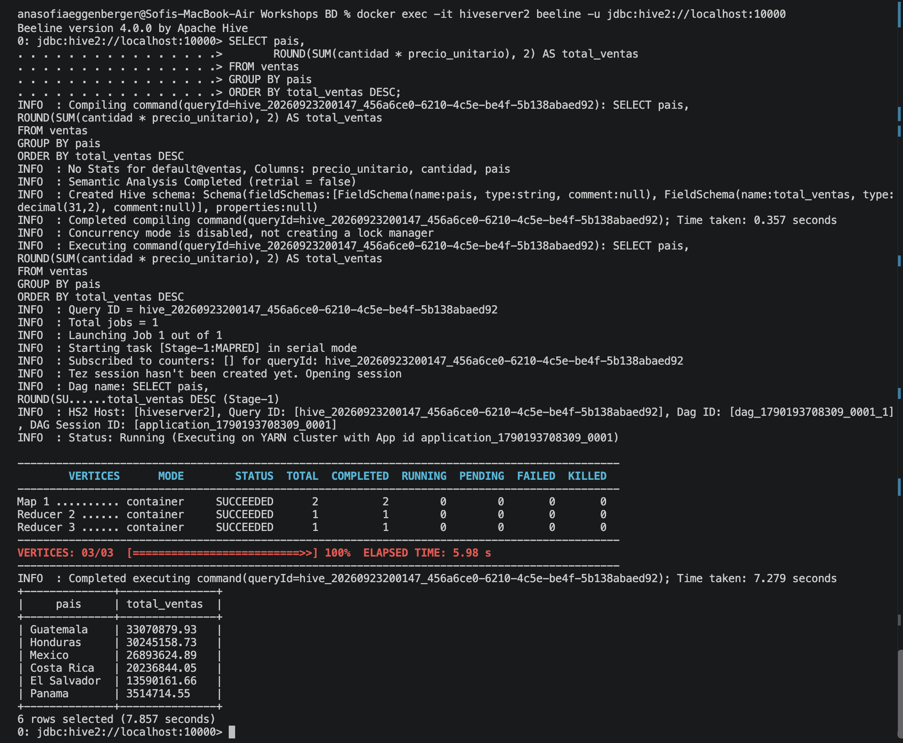
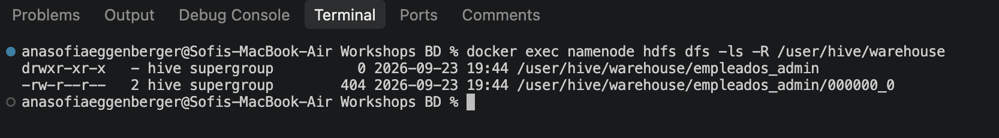
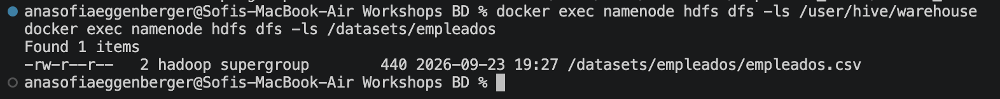
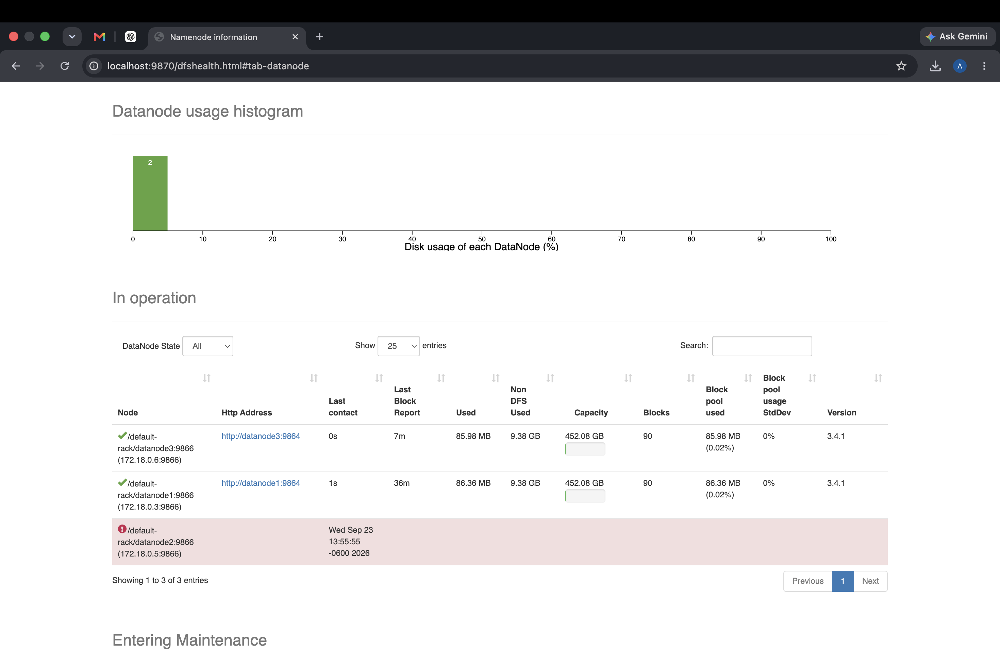

# Bitácora del taller Hadoop y Hive

- **Nombre:** Ana Sofía Eggenberger
- **Carné:** 20240449
- **Grupo:** G1
- **Mini-reto asignado al grupo:** A
- **Sistema operativo y chip de tu laptop:** macOS, Apple Silicon

## 1. Evidencias

### E1. NameNode con 3 DataNodes vivos (Paso 10)



Lo que muestra: La interfaz del NameNode reconoce los tres DataNodes del clúster como activos.

### E2. Ubicación de los bloques del archivo de mi grupo (Paso 10)



Lo que muestra: El archivo `ventas_G1.csv` está dividido en 6 bloques y cada bloque tiene una copia en dos DataNodes diferentes.

### E3. Un bloque físico dentro de un DataNode (Paso 4 o 10)



Lo que muestra: Encontré físicamente el bloque `blk_1073741830` dentro de `datanode1` y con `head` pude ver datos reales del archivo de ventas.

### E4. Resultado de la consulta de negocio de mi grupo (Paso 8)



Lo que muestra: La consulta del mini-reto A calcula las ventas totales por país y muestra a Guatemala con el total más alto.

### E5. Warehouse antes y después del `DROP` (Paso 9)

**Antes del DROP:**



**Después del DROP:**



Lo que muestra: La tabla administrada desapareció del warehouse al hacer `DROP`, mientras que el archivo de la tabla externa siguió existiendo en `/datasets/empleados`.

### E6. Clúster con un DataNode apagado (Paso 11)



Lo que muestra: Al apagar `datanode2`, el NameNode lo detectó como muerto mientras los otros dos DataNodes siguieron activos y los datos continuaron disponibles.

## 2. Preguntas de comprensión

**1. ¿Qué guarda el NameNode y qué guarda cada DataNode? Justifícalo con lo que encontraste en `/data/dfs/name` y en `/data/dfs/data`.**

El NameNode guarda los metadatos de HDFS, como qué archivos existen y en qué bloques están divididos. Los DataNodes guardan los bloques con los datos reales. Esto lo pude comprobar al encontrar archivos `blk_...` dentro de `/data/dfs/data` y leer directamente uno de ellos.

**2. Con tu salida de E2: ¿cuántos bloques tiene el archivo de tu grupo, en qué DataNodes está cada uno y por qué cada bloque aparece en dos nodos?**

Mi archivo `ventas_G1.csv` tiene 6 bloques. Todos tenían una copia en `datanode1` y la segunda estaba distribuida entre `datanode2` y `datanode3`. Cada bloque aparece en dos nodos porque el factor de replicación está configurado en 2.

**3. ¿En qué se diferencia `hdfs dfs -ls /datasets` de `ls /datasets` dentro del contenedor? ¿Dónde están "de verdad" los bytes del archivo?**

`hdfs dfs -ls /datasets` muestra archivos dentro del sistema de archivos HDFS, mientras que `ls /datasets` revisa el sistema de archivos local del contenedor. Los bytes realmente se guardan como bloques físicos dentro de los DataNodes, por ejemplo en `/data/dfs/data`.

**4. ¿Qué pasó con los datos al hacer `DROP TABLE` de la tabla externa y qué pasó con los de la administrada? ¿Por qué esa diferencia importa cuando varios equipos comparten un Data Lake?**

Al hacer `DROP` de la tabla externa se eliminó la tabla de Hive, pero el archivo original siguió en HDFS. En la tabla administrada, Hive eliminó también los datos del warehouse. Esto importa en un Data Lake compartido porque una tabla externa permite quitar una definición de Hive sin borrar los datos que otros equipos podrían utilizar.

**5. Al apagar `datanode2`: ¿pudiste seguir leyendo tu archivo? ¿Qué hizo el NameNode después de ~1 minuto? Relaciónalo con la P del teorema CAP.**

Sí, el archivo siguió disponible porque sus bloques tenían otra copia. Después de aproximadamente un minuto, el NameNode detectó `datanode2` como muerto y los bloques con menor replicación comenzaron a recuperarse en los nodos disponibles. Esto se relaciona con la P de CAP porque el sistema está diseñado para seguir funcionando aunque una parte del clúster deje de comunicarse con el resto.

**6. `WordCount.java` y la consulta de Hive dan el mismo resultado. ¿Qué gana y qué pierde un equipo que usa Hive en vez de escribir MapReduce a mano?**

Con Hive se gana simplicidad porque se puede expresar el análisis con SQL y no hay que programar manualmente todo el proceso de MapReduce. Se pierde parte del control sobre cómo se ejecuta el procesamiento. En el taller pude ver que Hive convirtió la consulta en un plan que se ejecutó usando Tez sobre YARN.

## 3. Mini-reto del grupo

**Pregunta de negocio (reto A):** ¿Cuáles son las ventas totales por país?

**Consulta:**

```sql
SELECT pais,
       ROUND(SUM(cantidad * precio_unitario), 2) AS total_ventas
FROM ventas
GROUP BY pais
ORDER BY total_ventas DESC;
```

**Resultado (pega la tabla que devolvió beeline):**

```text
+--------------+---------------+
|     pais     | total_ventas  |
+--------------+---------------+
| Guatemala    | 33070879.93   |
| Honduras     | 30245158.73   |
| Mexico       | 26893624.89   |
| Costa Rica   | 20236844.05   |
| El Salvador  | 13590161.66   |
| Panama       | 3514714.55    |
+--------------+---------------+
```

**Interpretación en una frase:** Guatemala fue el país con mayor total de ventas en el dataset de mi grupo, con Q33,070,879.93.

## 4. Problemas que tuve y cómo los resolví (opcional)

Al inicio tuve problemas para realizar el taller porque mi computadora anterior no era compatible con la versión de Docker que necesitaba. Al trabajar desde una computadora nueva pude instalar Docker, levantar los contenedores y completar el taller normalmente.

Durante el taller también noté que `dfs.replication` ya estaba configurado en 2 antes de levantar los tres DataNodes. Al iniciar `datanode2` y `datanode3`, Hadoop pudo distribuir las réplicas faltantes entre los nodos.