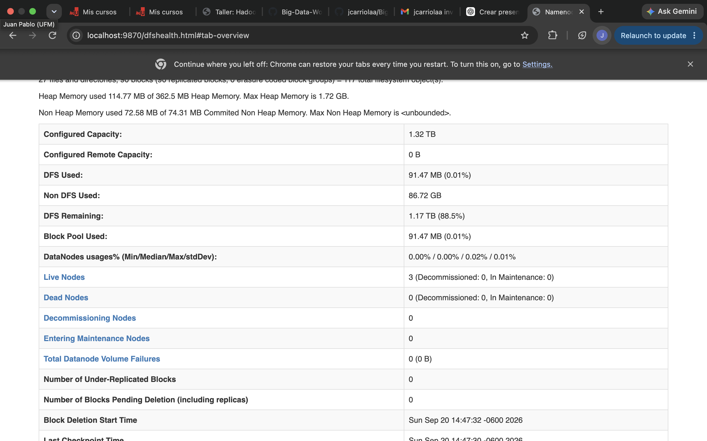
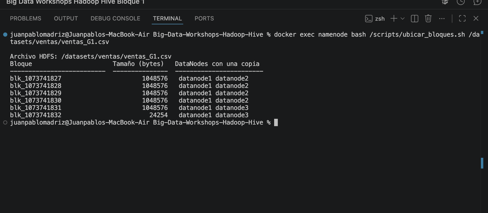
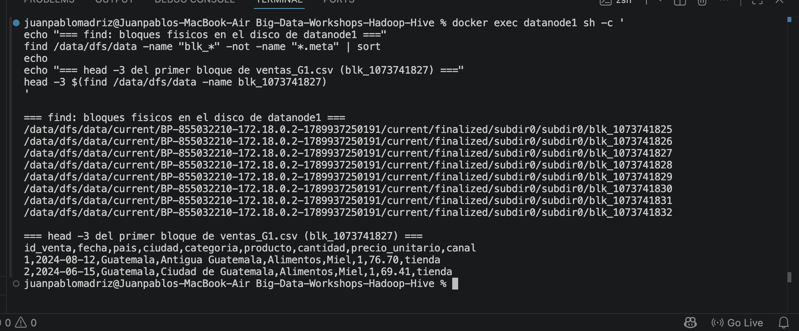
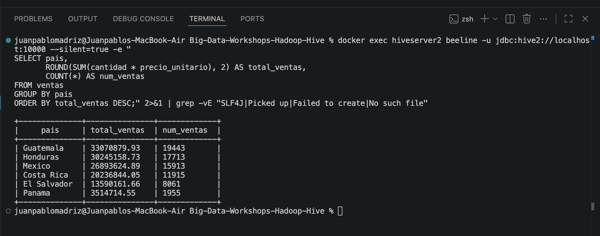
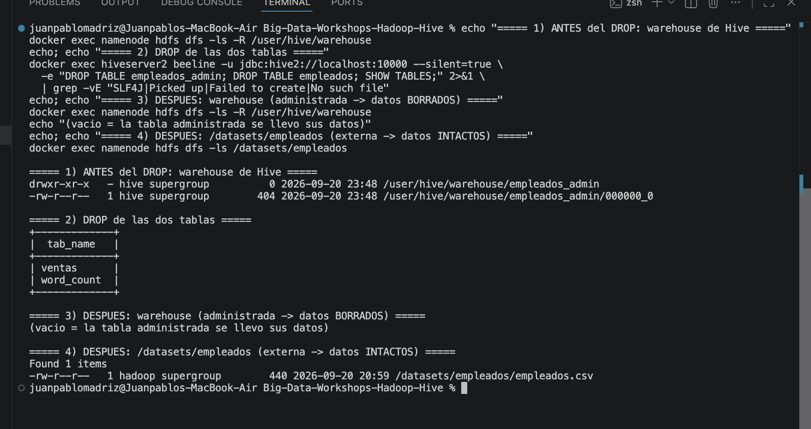
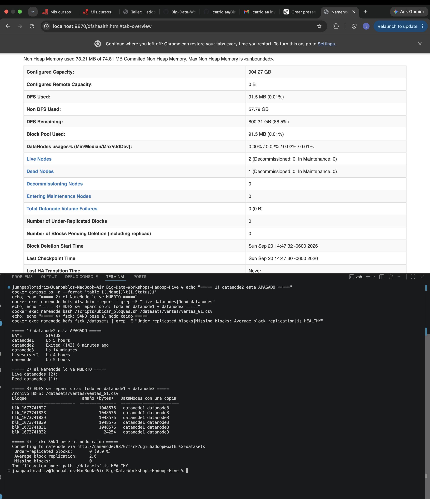

# Bitácora del taller Hadoop y Hive

- **Nombre:** Juan Pablo Madriz
- **Carné:** 20240841
- **Grupo:** G1
- **Mini-reto asignado al grupo:** A
- **Sistema operativo y chip de tu laptop:** macOS 15.7.3, Apple M3 (Rosetta activado para imágenes amd64)

## 1. Evidencias

### E1. NameNode con 3 DataNodes vivos (Paso 10)



Lo que muestra: Que la UI del namenode en localhost reporta 3 datanodes vivos y 0 muertos con 0 bloques sub-replicados

### E2. Ubicación de los bloques del archivo de mi grupo (Paso 10)



Lo que muestra: Que ventasg1 esta partido en 6 bloques, cinco de 1,048576 B y uno de 24,254 B, y que cada uno tiene copu en dos nodos distintos.

### E3. Un bloque físico dentro de un DataNode (Paso 4 o 10)



Lo que muestra: Que dento de datanode1 los bloques son archivos normales en dara/dfs/dara y que al abrir uno con head se lee el csv en texto plano.

### E4. Resultado de la consulta de negocio de mi grupo (Paso 8)



Lo que muestra: El resultado de mi reto A: ventas por pais con guatemala arriba (33,070,879.93 en 19,443 ventas) y Panamá abajo.

### E5. Warehouse antes y después del `DROP` (Paso 9)



Lo que muestra: que antes del drop el warehouse tenia empleados_admin/00000 con 404 B, despues quedo vacio y que empleados sobrevivio intacto in dataset.

### E6. Clúster con un DataNode apagado (Paso 11)



Lo que muestra: que datanode2 apago el namenode marca 2 vivos y 1 muertos los 6 bloques quedaron en datanode + datanode 3 y fsck sigue diciendo healthty.

## 2. Preguntas de comprensión

**1. ¿Qué guarda el NameNode y qué guarda cada DataNode?** En /data/dfs/name/current del NameNode encontré: VERSION, fsimage_..., edits_inprogress_..., seen_txid. Cero archivos blk_. -En /data/dfs/data de los DataNodes: archivos blk_<id> con los bytes, y su pareja .meta con los checksums. Cero fsimage. El DataNode no sabe a qué archivo pertenece cada bloque. Si se pierde /data/dfs/name, los bloques siguen ahí pero nadie sabe cómo rearmarlos.

**2. Con tu salida de E2: ¿cuántos bloques tiene el archivo de tu grupo, en qué DataNodes está cada uno y por qué cada bloque aparece en dos nodos?** 6 bloques. Cinco de 1,048,576 B más uno de 24,254 B. Comprobación: 5×1,048,576 + 24,254 = 5,267,134 B, el tamaño exacto del archivo. Los bloques 827 a 830 quedaron en datanode1 y datanode2, y el 831 y 832 en datanode1 y datanode3. Dos copias por dos razones, no una: puse dfs.replication=2 y corrí hdfs dfs -setrep -w 2 /datasets. Solo cambiar el XML no habría servido, porque esos archivos ya existían con replicación 1. Y nunca pone las dos copias en el mismo nodo, porque si falla ese disco se pierden las dos.

**3. ¿En qué se diferencia `hdfs dfs -ls /datasets` de `ls /datasets` dentro del contenedor? ¿Dónde están "de verdad" los bytes del archivo?** En el mismo contenedor: hdfs dfs -ls /datasets lista tres carpetas; ls /datasets responde No such file or directory. Los bytes están repartidos en /data/dfs/data de los DataNodes, en 6 pedazos. /datasets solo existe en el fsimage.

**4. ¿Qué pasó con los datos al hacer `DROP TABLE` de la tabla externa y qué pasó con los de la administrada? ¿Por qué esa diferencia importa cuando varios equipos comparten un Data Lake?** Administrada: datos en /user/hive/warehouse/empleados_admin/, dueño hive. Tras el DROP, warehouse vacío. Se llevó los datos. Externa: datos en /datasets/empleados/. Tras el DROP, el CSV sigue con 440 B y el mismo timestamp de cuando lo subí. Ni se tocó. En un Data Lake varios equipos y herramientas (Hive, Spark, Trino) leen los mismos archivos. Con tablas externas, borrar una tabla borra una vista, no los datos de todos.

**5. Al apagar `datanode2`: ¿pudiste seguir leyendo tu archivo? ¿Qué hizo el NameNode después de ~1 minuto? Relaciónalo con la P del teorema CAP.** Sí. Apagué datanode2 y leí el archivo de inmediato: salieron las 75,001 líneas completas. En esa primera lectura aparecieron 57 líneas de avisos del cliente intentando datanode2 y pasándose a la otra copia; en la segunda ya no salieron. A los ~50 segundos (2×10000 + 10×3000 ms, por el recheck-interval que configuré) el NameNode lo marcó muerto y mandó a copiar a datanode3 los 4 bloques que tenía ahí. fsck volvió a HEALTHY con replicación 2.0. Eso es la P de CAP: hubo una partición y el sistema siguió respondiendo, no porque la resolviera sino porque ya había replicado antes. La tolerancia a particiones se paga por adelantado en disco: mis 5 MB ocupan 10 MB en el clúster.

**6. `WordCount.java` y la consulta de Hive dan el mismo resultado. ¿Qué gana y qué pierde un equipo que usa Hive en vez de escribir MapReduce a mano?** Resultado idéntico: guarda 6, el 5, bloques 4, cada 4, datanode 4. Los mismos números por los dos caminos. MapReduce: ~84 líneas de Java, compilar, empaquetar en un JAR. Hive: una consulta con LATERAL VIEW explode(split(...)). Se gana velocidad para escribir y que cualquiera que sepa SQL puede consultar sin saber Java. Se pierde el control fino: en WordCount.java uno decide el combiner y el particionado, en Hive depende de lo que elija el optimizador. El EXPLAIN mostró Reducer 2 <- Map 1 (SIMPLE_EDGE). Hive no reemplazó MapReduce, generó igual una fase Map y una Reduce. Lo escondió detrás de SQL.

## 3. Mini-reto del grupo

**Pregunta de negocio (reto A):** Ventas totales (`cantidad * precio_unitario`) por **país**, ordenadas de mayor a menor. ¿Cuál país concentra más ventas?

**Consulta:**

```sql
SELECT pais,
       ROUND(SUM(cantidad * precio_unitario), 2) AS total_ventas,
       COUNT(*) AS num_ventas
FROM ventas
GROUP BY pais
ORDER BY total_ventas DESC;
```

**Resultado (pega la tabla que devolvió beeline):**

```
+--------------+---------------+-------------+
|     pais     | total_ventas  | num_ventas  |
+--------------+---------------+-------------+
| Guatemala    | 33070879.93   | 19443       |
| Honduras     | 30245158.73   | 17713       |
| Mexico       | 26893624.89   | 15913       |
| Costa Rica   | 20236844.05   | 11915       |
| El Salvador  | 13590161.66   | 8061        |
| Panama       | 3514714.55    | 1955        |
+--------------+---------------+-------------+
```

**Interpretación en una frase:**
Guatemala concentra la mayor facturación (33.07 M en 19,443 ventas), Panamá es marginal (3.5 M en 1,955) — casi 10 veces menos. Por ciudad gana Tegucigalpa con 15,130,869.97, no una ciudad guatemalteca, porque las ventas de Guatemala se reparten entre más ciudades.

## 4. Problemas que tuve y cómo los resolví 

**a) Paso 6 — HiveServer2 se colgaba al inicializar el metastore (Apple Silicon)**

`schematool` quedaba bloqueado indefinidamente con CPU al 0.00%. Diagnóstico: el proceso padre
tenía un hilo atascado en `kernel_clone` (dentro de `fork()`) y el hijo tenía un solo hilo en
`futex_wait_queue`, o sea un fork que nunca completó el exec. La traza reveló la causa:
`schematool` usa beeline, beeline usa jline, y jline lanza `stty` en un subproceso para medir el
terminal. Ese `fork()` en un proceso multihilo se bloquea bajo emulación Rosetta, y el contenedor
ni siquiera tiene TTY. Arreglo, agregado al `docker-compose.yml`:

```yaml
      _JAVA_OPTIONS: "-Djline.terminal=jline.UnsupportedTerminal"
```

(Antes probé `-Djdk.lang.Process.launchMechanism=POSIX_SPAWN`, que quitó el cuelgue pero falló con
`NoClassDefFoundError: java.lang.UNIXProcess` porque ese modo necesita el binario `jspawnhelper`.)

**b) Paso 6 — HiveServer2 reintentaba arrancar cada 60 s**

`/tmp/hive/hive.log` decía: `The dir: /tmp/hive on HDFS should be writable. Current permissions
are: rwxr-xr-x`. `hdfs dfs -mkdir` crea con 755 y HiveServer2 exige escritura para "otros".
Lo interesante: pasó **a pesar** de tener `dfs.permissions.enabled=false`, porque esa propiedad
apaga la verificación de **HDFS**, pero Hive lee los bits por su cuenta. Son dos capas distintas.
Arreglo (no está en el README):

```bash
docker exec namenode hdfs dfs -chmod -R 1777 /tmp/hive /user/hive/warehouse
```

**c) Paso 9 — la tabla administrada salió como `EXTERNAL_TABLE`**

El README espera `MANAGED_TABLE`. Verifiqué que `hive-site.xml` sí estaba montado y sí tenía
`metastore.metadata.transformer.class` con `<value></value>`, pero Hive responde que la propiedad
está `undefined`: interpreta el valor vacío como "no configurada" y usa el transformador por
defecto, que en Hive 4 convierte las administradas no transaccionales en externas con purga.
Un `SET` de sesión tampoco funciona porque el transformador se instancia al arrancar el metastore.
El experimento igual demuestra el punto: con `external.table.purge=TRUE` el `DROP` borró los datos.

**d) Paso 5 — el contador `Map output records` no coincidía con el README**

El README dice 75 y me salió 92. Lo verifiqué con `wc -w`: `word_count.txt` tiene 92 palabras y
49 distintas. El README quedó desactualizado (su ejemplo cita un archivo de 551 bytes y el del
repo pesa 522). El `Reduce output records=49` sí coincide.

**e) Paso 3 — `dfsadmin -report | head -12` no muestra `Live datanodes`**

En Hadoop 3.4.1 el informe trae más líneas de cabecera que las del ejemplo del README.
Usé `| grep -A6 "Live datanodes"` en su lugar.
