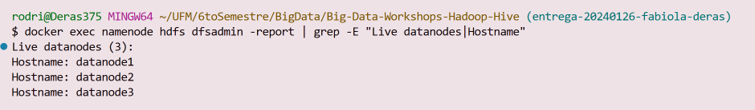
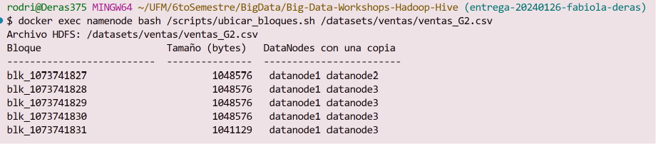
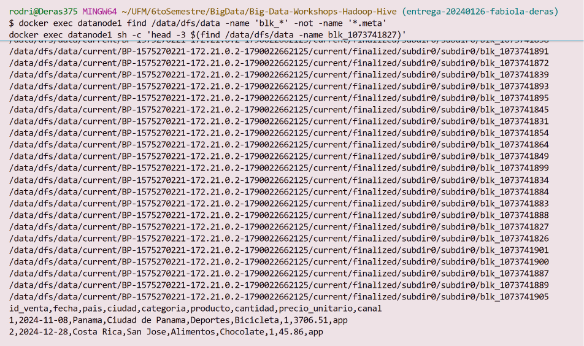
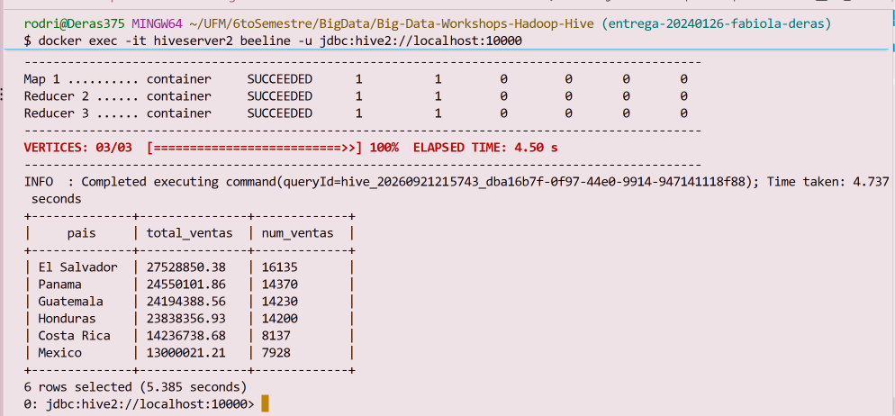
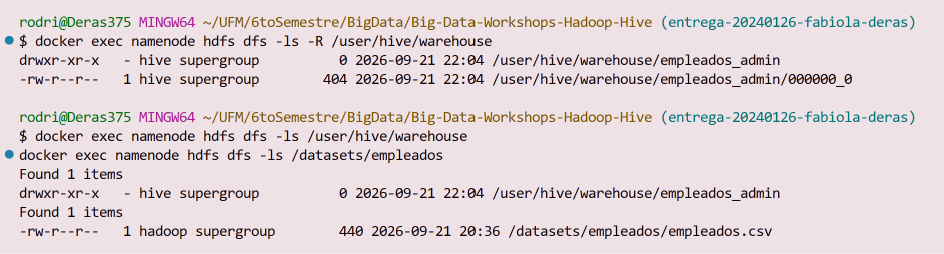
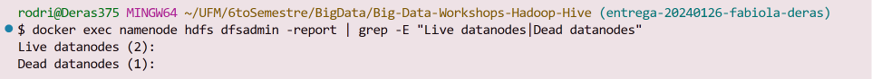

# Bitácora del taller Hadoop y Hive

- **Nombre:** Fabiola Deras Gutierrez
- **Carné:** 2024'126
- **Grupo:** G2
- **Mini-reto asignado al grupo:** B
- **Sistema operativo y chip de tu laptop:** Windows 11

## 1. Evidencias

### E1. NameNode con 3 DataNodes vivos (Paso 10)



Lo que muestra: el reporte de hdfs dfsadmin -report después de agregar datanode2 y datanode3 en el docker-compose.yml y cambiar dfs.replication a 2, confirmando que los 3 DataNodes ya están vivos y el NameNode los reconoce.

### E2. Ubicación de los bloques del archivo de mi grupo (Paso 10)



Lo que muestra: la salida de ubicar_bloques.sh sobre el archivo que me tocaba, ventas_G2.csv. Tiene 5 bloques (blk_1073741827 al blk_1073741831), y cada uno aparece en datanode1 más otro de los dos nodos nuevos, porque con replicación 2 cada bloque necesita dos copias en nodos distintos.

### E3. Un bloque físico dentro de un DataNode (Paso 4 o 10)



Lo que muestra: dentro de datanode1, el archivo blk_1073741827 (el primer bloque de ventas_G2.csv) como un archivo común en /data/dfs/data, y su contenido en texto plano con el encabezado y las primeras filas de mi CSV, prueba de que un bloque es prácticamente que un pedazo del archivo cortado por tamaño.

### E4. Resultado de la consulta de negocio de mi grupo (Paso 8)



Lo que muestra: el resultado de la consulta de ventas totales por país sobre ventas_G2.csv, agrupado por país y ordenado de mayor a menor.

### E5. Warehouse antes y después del DROP (Paso 9)



Lo que muestra: el ls -R de /user/hive/warehouse antes del DROP y después (o sea vacío), junto con el ls de /datasets/empleados, que sigue teniendo empleados.csv intacto porque es una tabla era externa.

### E6. Clúster con un DataNode apagado (Paso 11)



Lo que muestra: el reporte del NameNode después de docker compose stop datanode2, marcándolo como Dead datanodes (1) mientras datanode1 y datanode3 siguen como Live datanodes.

## 2. Preguntas de comprensión

> 2 a 5 líneas por respuesta, con tus palabras y con lo que viste en tu máquina. No copies definiciones.

**1. ¿Qué guarda el NameNode y qué guarda cada DataNode?** Justifícalo con lo que encontraste en /data/dfs/name y en /data/dfs/data.

El NameNode solo guarda el índice: en /data/dfs/name/current encontré fsimage (la foto del árbol de carpetas y qué bloques forman cada archivo) y los edits (el registro de cambios desde esa foto), pero ningún bloque real. Los DataNodes son los que tienen los bytes en /data/dfs/data de datanode1 encontré los archivos blk_* como archivos comunes de Linux, y por ende se úeden leer directo con head/tail porque son texto plano.

**2. Con tu salida de E2: ¿cuántos bloques tiene el archivo de tu grupo, en qué DataNodes está cada uno y por qué cada bloque aparece en dos nodos?**

El archivo ventas_G2.csv tiene 5 bloques (blk_1073741827 al blk_1073741831). Todos tienen una copia en datanode1 y la segunda copia repartida entre datanode2 y datanode3 (por ejemplo el primero quedó en datanode1 y datanode2, los demás en datanode1 y datanode3). Aparecen en dos nodos porque configuré dfs.replication = 2 en hdfs-site.xml: le pedí a HDFS dos copias de cada bloque para que, si un nodo se cae, la otra copia siga disponible.

**3. ¿En qué se diferencia hdfs dfs -ls /datasets de ls /datasets dentro del contenedor? ¿Dónde están "de verdad" los bytes del archivo?**

hdfs dfs -ls lee el sistema de archivos distribuido, la ruta virtual que solo conoce el NameNode. ls normal lee el disco local del contenedor, y ahí /datasets no existe, por eso da "No such file or directory". Los bytes de verdad están repartidos en /data/dfs/data de cada DataNode, partidos en bloques; /datasets/... es solo el nombre lógico que el NameNode usa para saber qué bloques, en qué nodos, forman ese archivo.

**4. ¿Qué pasó con los datos al hacer DROP TABLE de la tabla externa y qué pasó con los de la administrada? ¿Por qué esa diferencia importa cuando varios equipos comparten un Data Lake?**

Al hacer DROP TABLE empleados_admin (administrada), Hive borró también los archivos que había copiado a /user/hive/warehouse. Al hacer DROP TABLE empleados (externa), solo se borró el metadato del catálogo; empleados.csv siguió intacto en /datasets/empleados/. Esto importa en un Data Lake porque ahí varios equipos y herramientas como Hive, Spark, Trino leen los mismos archivos: si las tablas fueran administradas, un DROP de un equipo podría borrar los datos que otro equipo todavía necesita.

**5. Al apagar datanode2: ¿pudiste seguir leyendo tu archivo? ¿Qué hizo el NameNode después de ~1 minuto? Relaciónalo con la P del teorema CAP.**

Sí, pude seguir leyendo mi ventas_G2.csv completo (75000 filas) sin ningún error justo después de apagar datanode2, porque cada bloque que tenía ahí una copia todavía tenía la otra copia viva en datanode1 o datanode3. Después de un poco menos de un minuto, cuando datanode2 dejó de mandar latidos, el NameNode lo marcó como Dead datanode y empezó a reponer las copias perdidas en el nodo que quedaba libre. Es la P de CAP en acción: el sistema siguió respondiendo aunque hubo una partición (un nodo caído), porque ya tenía redundancia preparada de antemano.

**6. WordCount.java y la consulta de Hive dan el mismo resultado. ¿Qué gana y qué pierde un equipo que usa Hive en vez de escribir MapReduce a mano?**

Gana velocidad de desarrollo: la misma lógica de WordCount.java (60 líneas de Java) se resuelve en una sola consulta SQL con LATERAL VIEW explode. También gana que cualquiera que sepa SQL puede consultar los datos sin saber programar MapReduce. Lo que pierde es control fino: Hive decide por debajo cómo arma las fases Map y Reduce (se mira con EXPLAIN), así que si hay algo que optimizar a mano, es más difícil que en un programa Java donde se controla cada paso.


## 3. Mini-reto del grupo

**Pregunta de negocio (reto B):** Los 5 productos con más unidades vendidas. ¿Cuántas unidades vendió el primero?

**Consulta:**

```sql
SELECT producto, SUM(cantidad) AS unidades_vendidas
FROM ventas
GROUP BY producto
ORDER BY unidades_vendidas DESC
LIMIT 5;
```

**Resultado (pega la tabla que devolvió beeline):**

```
+-----------+--------------------+
| producto  | unidades_vendidas  |
+-----------+--------------------+
| Zapatos   | 9800               |
| Lampara   | 9750               |
| Balon     | 9738               |
| Cafetera  | 9711               |
| Pantalon  | 9682               |
+-----------+--------------------+
```

**Interpretación en una frase:** En mi archivo ventas_G2.csv, el producto más vendido fue Zapatos con 9800 unidades, apenas por encima de Lampara y Balon, así que no hay un producto que domine por mucho al resto.

## 4. Problemas que tuve y cómo los resolví (opcional)

Tuve un error de Git Bash (MINGW64), ya que este convierte automáticamente las rutas que empiezan con / a rutas de Windows antes de mandarlas a docker exec, así que /datasets/empleados se transforma en algo como C:/Program Files/Git/datasets/empleados, y HDFS interpreta la C: como un "scheme" inválido — de ahí "No FileSystem for scheme 'C'".

La manera de arreglarlo fue desactivar la conversión de rutas solo para este comando:
MSYS_NO_PATHCONV=1 
- Ej:
MSYS_NO_PATHCONV=1 docker exec namenode hdfs dfs -mkdir -p /datasets/empleados /datasets/word_count /datasets/ventas
MSYS_NO_PATHCONV=1 docker exec namenode hdfs dfs -put /archivos/empleados/empleados.csv /datasets/empleados/
MSYS_NO_PATHCONV=1 docker exec namenode hdfs dfs -put /archivos/word_count/word_count.txt /datasets/word_count/
MSYS_NO_PATHCONV=1 docker exec namenode hdfs dfs -put /archivos/v...

O cambiando "/" por "//"
