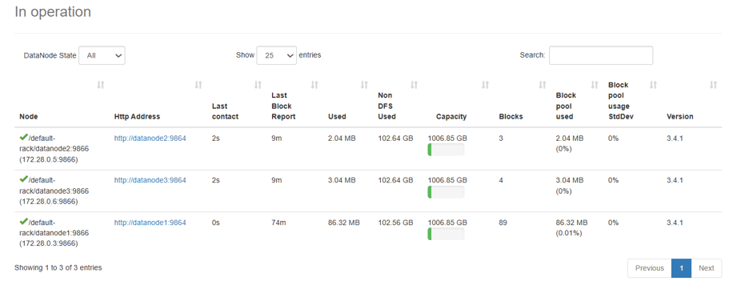
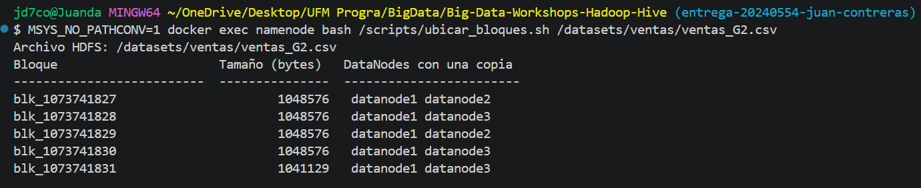
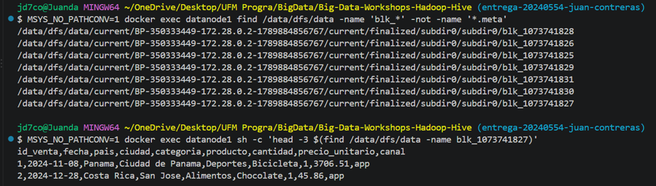
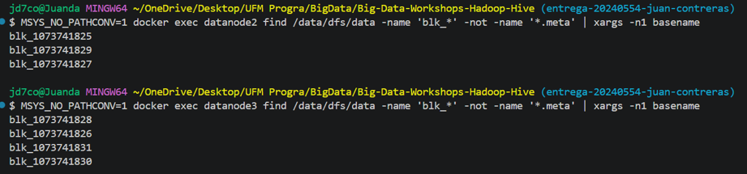
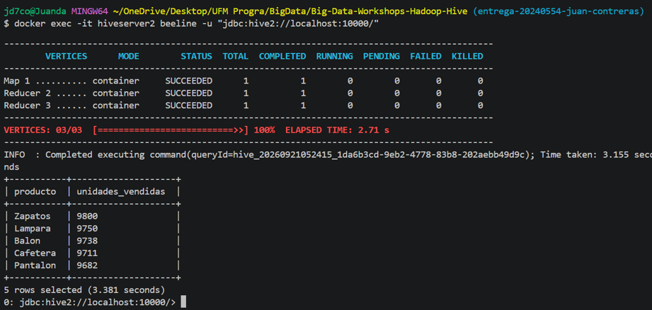
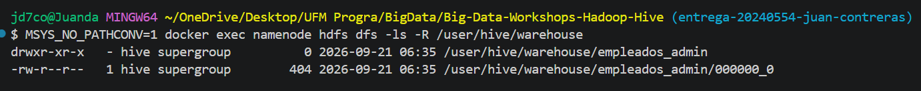
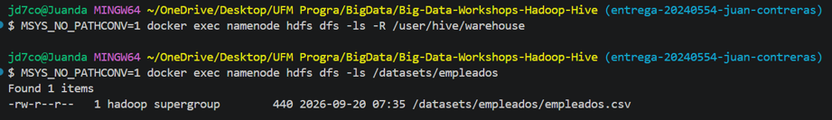
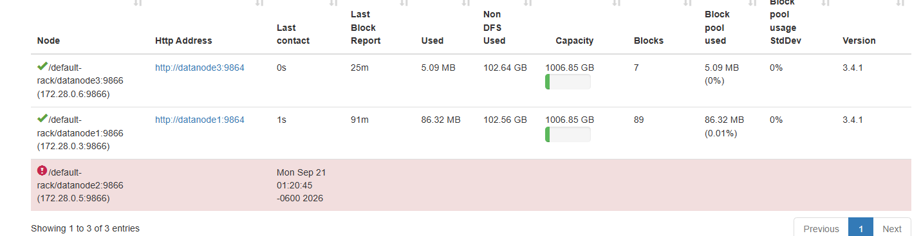
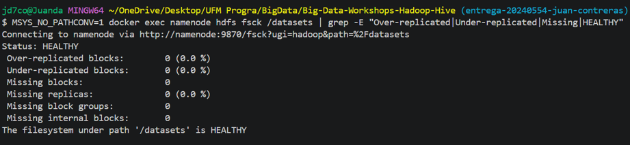

# Bitácora del taller Hadoop y Hive

* **Nombre:** Juan Contreras
* **Carné:** 20240554
* **Grupo:** G2
* **Mini-reto asignado al grupo:** B
* **Sistema operativo y chip de tu laptop:** Windows 11, Ryzen 9

## 1. Evidencias

### E1. NameNode con 3 DataNodes vivos (Paso 10)



Lo que muestra: El NameNode muestra los tres DataNodes activos: `datanode1`, `datanode2` y `datanode3`.

### E2. Ubicación de los bloques del archivo de mi grupo (Paso 10)



Lo que muestra: El archivo `ventas_G2.csv` está dividido en 5 bloques y cada bloque tiene dos copias distribuidas entre los DataNodes.

### E3. Un bloque físico dentro de un DataNode (Paso 4 o 10)






Lo que muestra: Se encontraron físicamente los archivos `blk_*` correspondientes a los bloques de HDFS dentro de los directorios de datos de los DataNodes.

### E4. Resultado de la consulta de negocio de mi grupo (Paso 8)



Lo que muestra: La consulta devuelve los cinco productos con mayor cantidad de unidades vendidas: Zapatos, Lampara, Balon, Cafetera y Pantalon.

### E5. Warehouse antes y después del `DROP` (Paso 9)





Lo que muestra: Al hacer `DROP` de la tabla administrada, sus archivos del warehouse desaparecieron, mientras que los archivos de la tabla externa en `/datasets/empleados/` permanecieron.

### E6. Clúster con un DataNode apagado (Paso 11)





Lo que muestra: Al apagar `datanode2`, el NameNode pasó a mostrar 2 DataNodes vivos y 1 muerto, pero el archivo de ventas pudo seguir leyéndose porque sus bloques todavía tenían copias disponibles.

## 2. Preguntas de comprensión

**1. ¿Qué guarda el NameNode y qué guarda cada DataNode?** Justifícalo con lo que encontraste en `/data/dfs/name` y en `/data/dfs/data`.

El NameNode guarda los metadatos de HDFS, como la información sobre archivos, bloques y su ubicación. Los DataNodes guardan físicamente los bloques de los archivos. Esto se pudo observar porque `/data/dfs/name` corresponde al almacenamiento del NameNode, mientras que en `/data/dfs/data` encontramos archivos físicos `blk_*`.

**2. Con tu salida de E2: ¿cuántos bloques tiene el archivo de tu grupo, en qué DataNodes está cada uno y por qué cada bloque aparece en dos nodos?**

`ventas_G2.csv` tiene 5 bloques. Los bloques `1827` y `1829` están en `datanode1` y `datanode2`, mientras que `1828`, `1830` y `1831` están en `datanode1` y `datanode3`. Aparecen en dos nodos porque configuramos un factor de replicación de 2 para tener una copia adicional de cada bloque.

**3. ¿En qué se diferencia `hdfs dfs -ls /datasets` de `ls /datasets` dentro del contenedor? ¿Dónde están "de verdad" los bytes del archivo?**

`hdfs dfs -ls /datasets` consulta el sistema de archivos HDFS, mientras que `ls /datasets` consulta el sistema de archivos local del contenedor. Los bytes de los archivos de HDFS están físicamente en los DataNodes, almacenados como bloques `blk_*` dentro de sus directorios de datos.

**4. ¿Qué pasó con los datos al hacer `DROP TABLE` de la tabla externa y qué pasó con los de la administrada? ¿Por qué esa diferencia importa cuando varios equipos comparten un Data Lake?**

Al hacer `DROP` de la tabla externa, los archivos originales en `/datasets/empleados/` permanecieron. En cambio, los archivos asociados a la tabla administrada dentro del warehouse fueron eliminados. Esto importa porque una tabla externa permite que varios equipos compartan datos sin que eliminar una tabla borre los archivos originales.

**5. Al apagar `datanode2`: ¿pudiste seguir leyendo tu archivo? ¿Qué hizo el NameNode después de ~1 minuto? Relaciónalo con la P del teorema CAP.**

Sí, pude seguir leyendo `ventas_G2.csv` porque sus bloques tenían otra copia disponible en `datanode1` o `datanode3`. Después de aproximadamente un minuto, el NameNode detectó a `datanode2` como muerto y mostró 2 DataNodes vivos y 1 muerto. Esto se relaciona con la P de CAP porque el sistema continúa funcionando a pesar de la falla o pérdida de comunicación con un nodo.

**6. `WordCount.java` y la consulta de Hive dan el mismo resultado. ¿Qué gana y qué pierde un equipo que usa Hive en vez de escribir MapReduce a mano?**

Con Hive se gana simplicidad porque se puede trabajar con SQL sin tener que programar toda la lógica de MapReduce. También facilita escribir consultas y análisis sobre los datos. A cambio, se tiene menos control directo sobre cómo se ejecutan internamente las operaciones.

## 3. Mini-reto del grupo

**Pregunta de negocio (reto B):**

Los 5 productos con más unidades vendidas. ¿Cuántas unidades vendió el primero?

**Consulta:**

```sql
SELECT producto,
       SUM(cantidad) AS unidades_vendidas
FROM ventas
GROUP BY producto
ORDER BY unidades_vendidas DESC
LIMIT 5;
```

**Resultado (pega la tabla que devolvió beeline):**

```text
+-----------+--------------------+
| producto  | unidades_vendidas  |
+-----------+--------------------+
| Zapatos   | 9800               |
| Lampara   | 9750               |
| Balon     | 9738               |
| Cafetera  | 9711               |
| Pantalon  | 9682               |
+-----------+--------------------+
5 rows selected
```

**Interpretación en una frase:**

Zapatos fue el producto con más unidades vendidas, con 9,800 unidades.

## 4. Problemas que tuve y cómo los resolví

Durante el taller encontré dos problemas principales relacionados con la ejecución de Hadoop y Hive desde Windows, además de dos situaciones menores que me ayudaron a comprender mejor el funcionamiento del clúster.

### Problemas principales

**1. Problema con las rutas de HDFS desde Git Bash — Paso 4 y Paso 10**

Al ejecutar comandos de HDFS y algunos scripts desde **Git Bash en Windows**, encontré que las rutas que comenzaban con `/` podían ser modificadas automáticamente. Por ejemplo, cuando intentaba ejecutar un script ubicado en `/scripts/ubicar_bloques.sh`, Git Bash podía interpretar esa ruta como una ruta de Windows antes de enviarla a Docker. Como consecuencia, el contenedor recibía una ruta diferente a la que realmente existía dentro del contenedor y el comando generaba errores relacionados con archivos o rutas que no encontraba.

Para solucionarlo utilicé `MSYS_NO_PATHCONV=1` antes de los comandos que trabajaban con rutas de Linux o HDFS. Esta opción evita que Git Bash convierta las rutas y hace que se envíen exactamente como fueron escritas. Por ejemplo:

```bash
MSYS_NO_PATHCONV=1 docker exec namenode hdfs dfs -ls /datasets
```

También utilicé esta opción al ejecutar scripts dentro del contenedor. Después de aplicar la solución, pude ejecutar correctamente comandos como `ubicar_bloques.sh` y obtener la ubicación de los bloques de `ventas_G2.csv`. Esto fue importante porque posteriormente pude comprobar que el archivo tenía 5 bloques y que cada bloque tenía dos copias distribuidas entre los DataNodes. A partir de este problema aprendí que, al trabajar con Docker y Hadoop desde Git Bash en Windows, debía tener cuidado con la conversión automática de rutas y utilizar `MSYS_NO_PATHCONV=1` cuando fuera necesario.

**2. Problema al iniciar HiveServer2 — Paso 7**

Al intentar utilizar HiveServer2 y conectarme mediante **Beeline**, encontré que el servicio no estaba iniciando correctamente. Los contenedores de Hadoop estaban funcionando, pero Hive necesitaba utilizar el directorio `/tmp/hive` de HDFS y este no tenía los permisos necesarios. Como consecuencia, HiveServer2 no podía trabajar correctamente con su directorio temporal y la conexión mediante Beeline fallaba.

Primero verifiqué que el problema no fuera simplemente que el contenedor estuviera detenido. Después identifiqué que el directorio `/tmp/hive` necesitaba permisos de escritura. Lo solucioné ejecutando:

```bash
MSYS_NO_PATHCONV=1 docker exec namenode hdfs dfs -chmod 777 /tmp/hive
```

Después tuve que reiniciar HiveServer2 y limpiar un archivo PID antiguo que impedía que el servicio iniciara correctamente. Una vez realizados estos pasos, HiveServer2 quedó funcionando y pude conectarme mediante Beeline.

La solución me permitió continuar con la parte de Hive del taller. Pude crear y consultar las tablas, realizar la comparación entre tablas administradas y externas y ejecutar la consulta de negocio correspondiente al mini-reto B. Por lo tanto, este problema inicialmente me impedía trabajar con Hive, pero después de corregir los permisos y reiniciar correctamente el servicio pude continuar con los Pasos 7, 8 y 9.

### Problemas pequeños o situaciones adicionales

**3. Diferencia en el comportamiento de la tabla administrada — Paso 9**

Durante la prueba de tablas administradas y externas encontré una diferencia respecto a lo que esperaba según la guía. Al revisar `DESCRIBE FORMATTED` en **Hive 4.0.0**, la tabla que había creado mediante `CREATE TABLE ... AS SELECT` aparecía como `EXTERNAL_TABLE`.

Para comprobar qué estaba ocurriendo realmente, no me basé únicamente en la información de `DESCRIBE FORMATTED`, sino que revisé directamente los archivos en HDFS antes y después de ejecutar `DROP TABLE`. Al hacer `DROP` de la tabla, los archivos asociados dentro del warehouse desaparecieron, mientras que los archivos originales de la tabla externa en `/datasets/empleados/` permanecieron.

Esto me permitió comprobar directamente el comportamiento de los datos y entender que la metadata de Hive no siempre era suficiente para explicar lo que estaba ocurriendo en este entorno. La comprobación física de los archivos me permitió entender mejor la diferencia entre ambos tipos de tablas.

**4. DataNode marcado como muerto durante la prueba de tolerancia a fallos — Paso 11**

Durante la prueba de tolerancia a fallos apagué `datanode2`. Inmediatamente después, el NameNode todavía podía mostrar el nodo como activo durante un tiempo, ya que necesitaba esperar para detectar que había dejado de enviar señales al NameNode. Después de aproximadamente un minuto, el NameNode lo identificó como **Dead Node** y pasó a mostrar 2 DataNodes vivos y 1 muerto.

A pesar de que `datanode2` estaba apagado, pude seguir leyendo `ventas_G2.csv`. Esto ocurrió porque el archivo tenía un factor de replicación de 2 y cada bloque tenía otra copia disponible en `datanode1` o `datanode3`. Al finalizar la prueba, volví a iniciar `datanode2` y verifiqué que el clúster regresara a tener los tres DataNodes activos.

Esta situación me permitió comprobar directamente cómo la replicación de HDFS permite que los datos continúen disponibles cuando uno de los DataNodes deja de funcionar.
