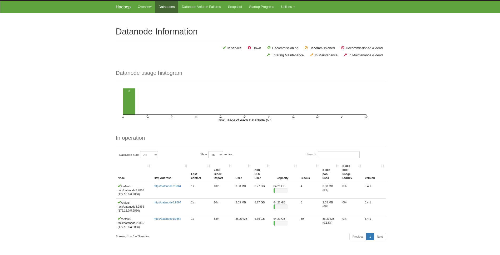
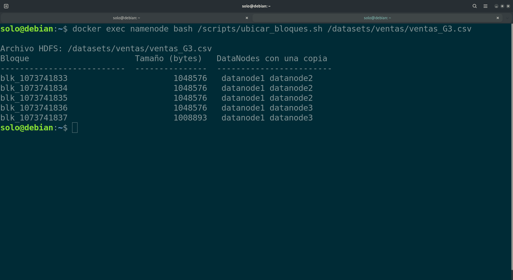
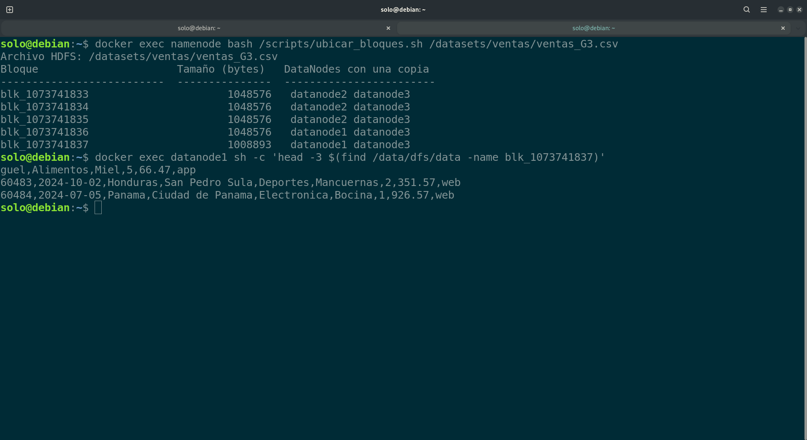
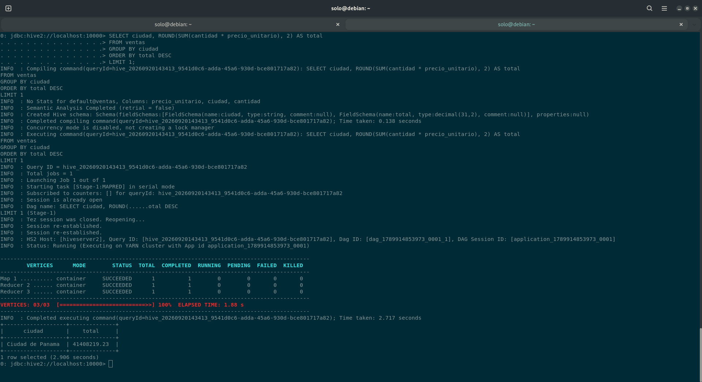
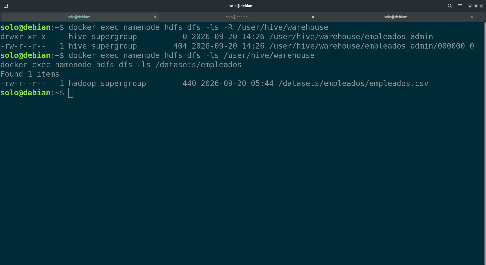
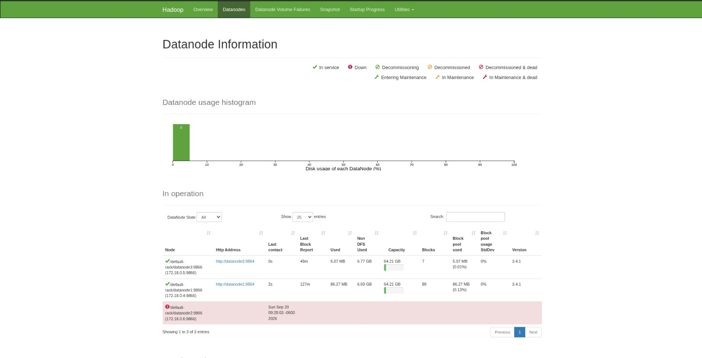
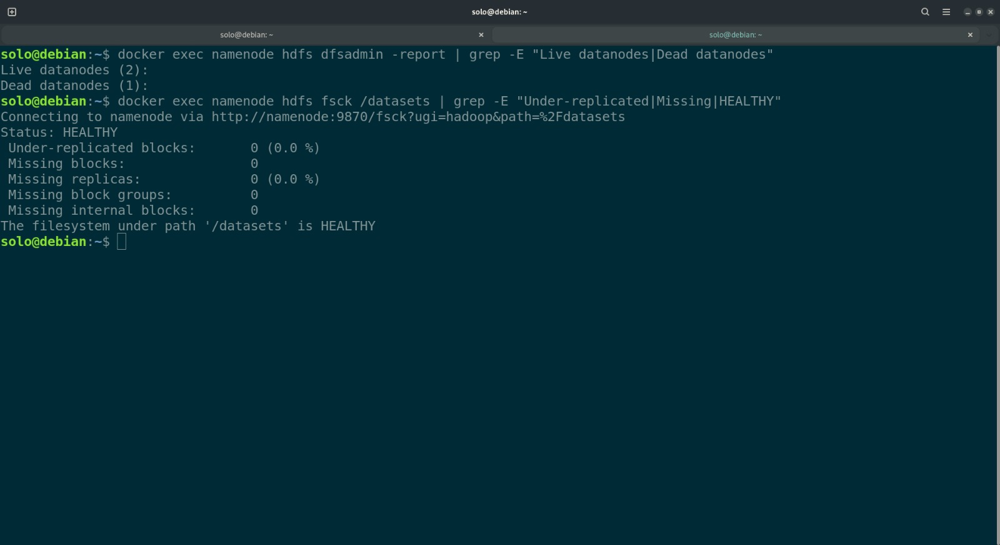

# Bitácora del taller Hadoop y Hive

- **Nombre:** Juan Andres Ochaita Marroquin
- **Carné:** 20240563
- **Grupo:** G3
- **Mini-reto asignado al grupo:** C
- **Sistema operativo y chip de tu laptop:** Debian 13 en una HP ProBook con procesador Intel Core i7 de 13.ª genera


## 1. Evidencias

### E1. NameNode con 3 DataNodes vivos (Paso 10)



Lo que muestra:

### E2. Ubicación de los bloques del archivo de mi grupo (Paso 10)



Lo que muestra:

### E3. Un bloque físico dentro de un DataNode (Paso 4 o 10)



Lo que muestra:

### E4. Resultado de la consulta de negocio de mi grupo (Paso 8)



Lo que muestra:

### E5. Warehouse antes y después del `DROP` (Paso 9)



Lo que muestra:

### E6. Clúster con un DataNode apagado (Paso 11)




Lo que muestra:

## 2. Preguntas de comprensión


**1. ¿Qué guarda el NameNode y qué guarda cada DataNode?** Justifícalo con lo que encontraste en `/data/dfs/name` y en `/data/dfs/data`.

- NameNode guarda la metadata de HDFS (Hadoop Distributed File System) en forma de los siguientes archivos: fsimage_*, edits_*, VERSION, seen_txid y los DataNode guardan los bloques de los archivos de la data; con replicas y distribuyendola en forma de archivs: blk_*, blk_*.meta.

**2. Con tu salida de E2: ¿cuántos bloques tiene el archivo de tu grupo, en qué DataNodes está cada uno y por qué cada bloque aparece en dos nodos?**

- El archivo de mi grupo tiene un total de 5 bloques: blk_1073741833 en los DataNodes: 1048576   datanode2 datanode1, blk_1073741834 en los DataNodes: 1048576   datanode2 datanode1, blk_1073741835 en los DataNodes: 1048576   datanode2 datanode1, blk_1073741836 en los DataNodes: 1048576   datanode1 datanode3 y blk_1073741837 en los DataNodes: datanode1 datanode3. Cada bloque aparece en dos nodos ya que se ajusto una replicacion de 2:

```
  <property>
    <name>dfs.replication</name>
    <value>2</value>
  </property>
```

**3. ¿En qué se diferencia `hdfs dfs -ls /datasets` de `ls /datasets` dentro del contenedor? ¿Dónde están "de verdad" los bytes del archivo?**
- El comando `hdfs dfs -ls /datasets` busca dentro de todo el sistema distribuido de HDFS dentro del NameNode mientras que el comando `ls /datasets` solo busca dentro de la memoria local del contenedor.

**4. ¿Qué pasó con los datos al hacer `DROP TABLE` de la tabla externa y qué pasó con los de la administrada? ¿Por qué esa diferencia importa cuando varios equipos comparten un Data Lake?**
- La tabla externa permite ejecutar DROP TABLE sin borrar los archivos de datos originales; únicamente elimina los metadatos del catálogo. En cambio, la tabla administrada elimina la tabla y los datos que Hive almacena y administra.  Es importante dentro de un Data Lake ya que permite la creacion y eliminarion de tablas sin elminar los datos de oringen.

**5. Al apagar `datanode2`: ¿pudiste seguir leyendo tu archivo? ¿Qué hizo el NameNode después de ~1 minuto? Relaciónalo con la P del teorema CAP.**
- Despues de apagar `datanode2` si se pudo seguir leyendo el archivo devido a la replicacion de 2. Despues de ~1 minuto NameNode detecto que el `datanode2` ya no estaba dando señales de vida, por lo que empezo a realizar una replizacion a otros nodos disponibles. Se relaciona a P de CAP ya que HDFS tolera las particiones, aun cuando se pierde un nodo mantiene los datos disponibles. 

**6. `WordCount.java` y la consulta de Hive dan el mismo resultado. ¿Qué gana y qué pierde un equipo que usa Hive en vez de escribir MapReduce a mano?**
- Un equipo que utiliza Hive gana velocidad de desarrollo y reduccion de complejidad de consultas. Pierde control y personalizacion.  

## 3. Mini-reto del grupo

**Pregunta de negocio (reto C):**
Ventas totales por mes (substr(fecha, 1, 7)). ¿Cuál fue el mejor mes y cuál el peor?

**Consulta:**

```sql
SELECT
  substr(fecha, 1, 7) AS mes,
  SUM(cantidad * precio_unitario) AS ventas_totales
FROM ventas
GROUP BY substr(fecha, 1, 7)
ORDER BY ventas_totales DESC;
```

**Resultado (pega la tabla que devolvió beeline):**

```
+----------+-----------------+
|   mes    | ventas_totales  |
+----------+-----------------+
| 2024-10  | 11300260.07     |
| 2024-08  | 10962369.24     |
| 2024-05  | 10896129.57     |
| 2024-01  | 10837272.60     |
| 2024-04  | 10657681.12     |
| 2024-11  | 10636962.42     |
| 2024-09  | 10631824.70     |
| 2024-12  | 10622992.62     |
| 2024-03  | 10564062.27     |
| 2024-02  | 10529744.95     |
| 2024-06  | 10490359.94     |
| 2024-07  | 10192715.23     |
+----------+-----------------+
```

**Interpretación en una frase:** El mejor mes fue Octubre (2024-10) con un total de ventas de **11300260.07**, el peor mes fue Julio (2024-07) con un total de ventas de **10192715.23**
