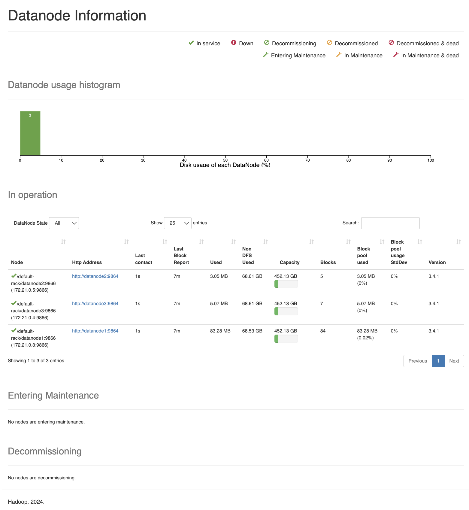
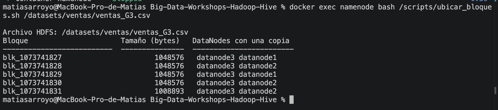
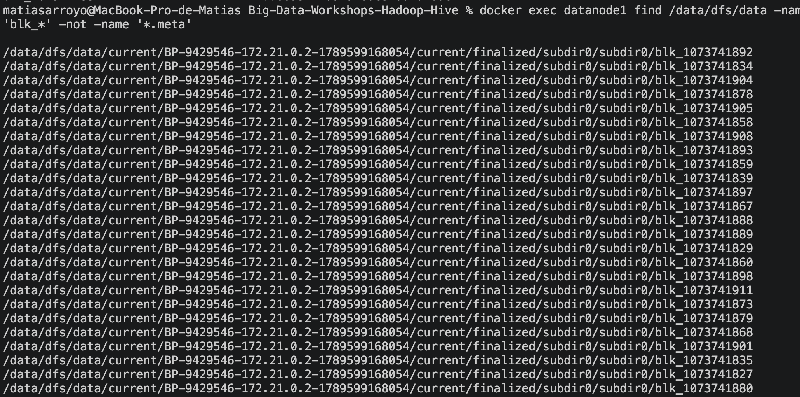
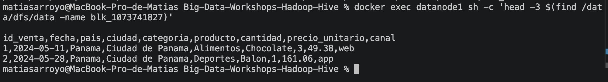
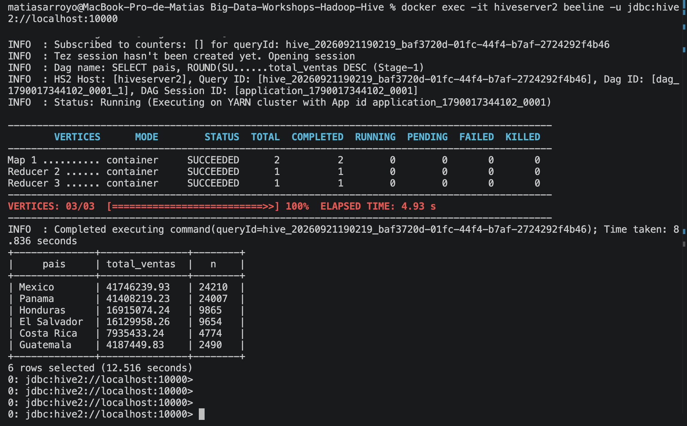
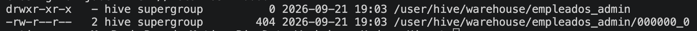
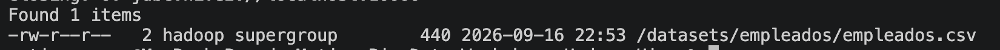
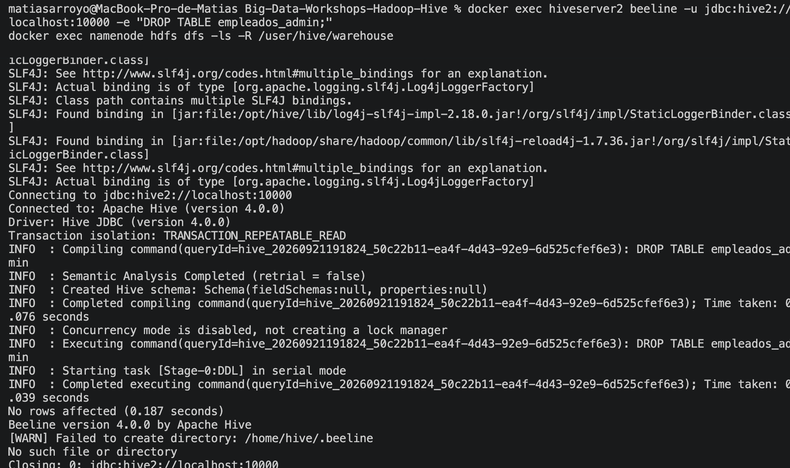
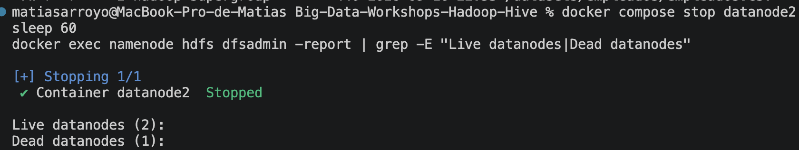

# Bitácora del taller Hadoop y Hive

- **Nombre:** Matías Arroyo
- **Carné:** 20240575
- **Grupo:** G3
- **Mini-reto asignado al grupo:** C
- **Sistema operativo y chip de tu laptop:** macOS 14.6.1 (Sonoma), Apple M3 Pro

## 1. Evidencias

### E1. NameNode con 3 DataNodes vivos (Paso 10)



Lo que muestra: la interfaz web del NameNode (`localhost:9870`) con `datanode1`, `datanode2` y `datanode3` en estado "In service" (✔️ verde), cada uno con 452.13 GB de capacidad y su propio número de bloques.

### E2. Ubicación de los bloques del archivo de mi grupo (Paso 10)



Lo que muestra: la salida de `ubicar_bloques.sh` para `ventas_G3.csv`: 5 bloques (`blk_1073741827` a `blk_1073741831`), cada uno con dos copias repartidas entre `datanode1`, `datanode2` y `datanode3`.

### E3. Un bloque físico dentro de un DataNode (Paso 4 o 10)




Lo que muestra: primero, el `find` dentro de `datanode1` listando los archivos `blk_*` que tiene guardados en su disco; después, el `head -3` del bloque `blk_1073741827`, que resulta ser texto plano con el encabezado y las primeras filas del CSV de ventas.

### E4. Resultado de la consulta de negocio de mi grupo (Paso 8)



Lo que muestra: el resultado en `beeline` de `SELECT pais, SUM(cantidad*precio_unitario)... GROUP BY pais`, con México (41,746,239.93) y Panamá (41,408,219.23) como los países con más ventas en mi archivo `ventas_G3.csv`.

### E5. Warehouse antes y después del `DROP` (Paso 9)





Lo que muestra: (a) antes del `DROP`, `/user/hive/warehouse/empleados_admin` existe con su archivo de datos, dueño `hive`; (b) mientras tanto, `empleados.csv` (la tabla externa) sigue intacto en `/datasets/empleados/`; (c) después de `DROP TABLE empleados_admin;`, el `ls -R /user/hive/warehouse` ya no devuelve nada — la carpeta quedó vacía.

### E6. Clúster con un DataNode apagado (Paso 11)



Lo que muestra: después de `docker compose stop datanode2` y esperar ~60 segundos, `hdfs dfsadmin -report` reporta `Live datanodes (2)` y `Dead datanodes (1)`.

## 2. Preguntas de comprensión

**1. ¿Qué guarda el NameNode y qué guarda cada DataNode?** Justifícalo con lo que encontraste en `/data/dfs/name` y en `/data/dfs/data`.

El NameNode solo guarda el índice: en `/data/dfs/name/current` lo único que hay es `VERSION`, `fsimage` y los `edits`, que describen qué archivos existen y en qué bloques están partidos, pero ningún byte de datos real. En cambio, dentro de `/data/dfs/data` de cada DataNode encontré los bloques (`blk_1073741827`, etc.) como archivos comunes de disco, y al abrir uno con `head` vi las filas de mi CSV de ventas en texto plano. Los datos viven en los DataNodes; el NameNode solo sabe dónde buscarlos.

**2. Con tu salida de E2: ¿cuántos bloques tiene el archivo de tu grupo, en qué DataNodes está cada uno y por qué cada bloque aparece en dos nodos?**

Mi archivo `ventas_G3.csv` tiene 5 bloques (`blk_1073741827` a `blk_1073741831`), cada uno de 1 MB salvo el último que tiene el sobrante (~1,008,893 bytes). Cada bloque aparece en dos DataNodes distintos (combinaciones entre `datanode1`, `datanode2` y `datanode3`) porque en el Paso 10 configuré `dfs.replication=2`: el NameNode le pide al cliente que escribe dos copias de cada bloque, en nodos diferentes, para que si uno se cae el archivo no se pierda.

**3. ¿En qué se diferencia `hdfs dfs -ls /datasets` de `ls /datasets` dentro del contenedor? ¿Dónde están "de verdad" los bytes del archivo?**

`hdfs dfs -ls /datasets` le pregunta al NameNode por una ruta del sistema de archivos distribuido (HDFS), que es un espacio de nombres virtual que no corresponde a ninguna carpeta real dentro del contenedor. `ls /datasets` en cambio busca esa carpeta en el disco local del contenedor, y como no existe ahí, el comando falla con "No such file or directory". Los bytes reales del archivo están repartidos en los discos de los DataNodes, dentro de `/data/dfs/data`, no en ningún lugar llamado `/datasets`.

**4. ¿Qué pasó con los datos al hacer `DROP TABLE` de la tabla externa y qué pasó con los de la administrada? ¿Por qué esa diferencia importa cuando varios equipos comparten un Data Lake?**

Al hacer `DROP TABLE` de `empleados_admin` (administrada), Hive borró tanto el metadato como la carpeta `/user/hive/warehouse/empleados_admin` con sus archivos: los datos desaparecieron de HDFS. Al hacer `DROP TABLE` de `empleados` (externa), Hive solo borró el metadato del catálogo; el archivo `empleados.csv` en `/datasets/empleados/` no se tocó y sigue ahí. Esta diferencia importa en un Data Lake porque varios equipos o herramientas (Hive, Spark, Trino) pueden estar leyendo la misma carpeta: si las tablas fueran administradas, un `DROP` de un equipo borraría los datos que otro equipo todavía necesita. Con tablas externas, cada equipo solo controla su propio catálogo de metadatos, no los archivos físicos.

**5. Al apagar `datanode2`: ¿pudiste seguir leyendo tu archivo? ¿Qué hizo el NameNode después de ~1 minuto? Relaciónalo con la P del teorema CAP.**

Sí, pude seguir leyendo `ventas_G3.csv` completo (75,001 líneas) mientras `datanode2` estaba apagado, porque cada bloque tenía otra copia disponible en `datanode1` o `datanode3` y el cliente simplemente usó esa. Después de aproximadamente 50-60 segundos, el NameNode declaró a `datanode2` como "Dead" (dejó de recibir sus latidos) y ordenó reconstruir en `datanode3` las copias de los bloques que se quedaron con una sola réplica viva. Esto es la P (tolerancia a particiones) del teorema CAP en acción: el sistema siguió respondiendo correctamente aunque una parte del clúster quedó inalcanzable, porque había replicado los datos por adelantado.

**6. `WordCount.java` y la consulta de Hive dan el mismo resultado. ¿Qué gana y qué pierde un equipo que usa Hive en vez de escribir MapReduce a mano?**

Corrí el `wordcount` de MapReduce y la consulta equivalente en Hive con `LATERAL VIEW explode(split(...))`, y ambos me dieron la misma palabra más frecuente ("guarda", con 6 apariciones). Con Hive gano velocidad de desarrollo: una consulta SQL de pocas líneas reemplaza las ~60 líneas de Java de `TokenizerMapper` e `IntSumReducer`, y no tengo que pensar en cómo particionar el trabajo. Lo que pierdo es control fino: no puedo decidir exactamente qué hace cada mapper o reducer, porque Hive genera ese plan por mí (lo vi con `EXPLAIN`, que mostró una fase Map y una Reduce equivalentes a las de mi programa Java).

## 3. Mini-reto del grupo

**Pregunta de negocio (reto C):** Ventas totales por mes (`substr(fecha, 1, 7)`). ¿Cuál fue el mejor mes y cuál el peor?

**Consulta:**

```sql
SELECT substr(fecha, 1, 7) AS mes, ROUND(SUM(cantidad * precio_unitario), 2) AS total_ventas
FROM ventas
GROUP BY substr(fecha, 1, 7)
ORDER BY mes;
```

**Resultado (pega la tabla que devolvió beeline):**

```
+----------+---------------+
|   mes    | total_ventas  |
+----------+---------------+
| 2024-01  | 10837272.60   |
| 2024-02  | 10529744.95   |
| 2024-03  | 10564062.27   |
| 2024-04  | 10657681.12   |
| 2024-05  | 10896129.57   |
| 2024-06  | 10490359.94   |
| 2024-07  | 10192715.23   |
| 2024-08  | 10962369.24   |
| 2024-09  | 10631824.70   |
| 2024-10  | 11300260.07   |
| 2024-11  | 10636962.42   |
| 2024-12  | 10622992.62   |
+----------+---------------+
```

**Interpretación en una frase:** Octubre de 2024 fue el mejor mes de ventas ($11,300,260.07) y julio de 2024 el peor ($10,192,715.23), aunque las ventas se mantienen bastante estables mes a mes (todas rondan los $10.5-11.3 millones), sin una tendencia estacional marcada en mi archivo `ventas_G3.csv`.

## 4. Problemas que tuve y cómo los resolví

Al levantar `hiveserver2` por primera vez (Paso 6), el contenedor entraba en un ciclo de reintentos con el error `The dir: /tmp/hive on HDFS should be writable. Current permissions are: rwxr-xr-x`, aunque `dfs.permissions.enabled` ya estaba en `false`. Lo resolví con `hdfs dfs -chmod -R 777 /tmp/hive /user/hive/warehouse` — Hive revisa los bits de permiso directamente, no si el usuario puede escribir de hecho.

Después, al hacer `docker compose restart hiveserver2` para aplicar ese cambio, el contenedor terminó con `Exited (1)` porque encontró un PID de HiveServer2 de la corrida anterior ("HiveServer2 running as process 7. Stop it first."). La solución fue usar `docker compose up -d --force-recreate hiveserver2` en vez de `restart`, para que el contenedor arrancara limpio.
