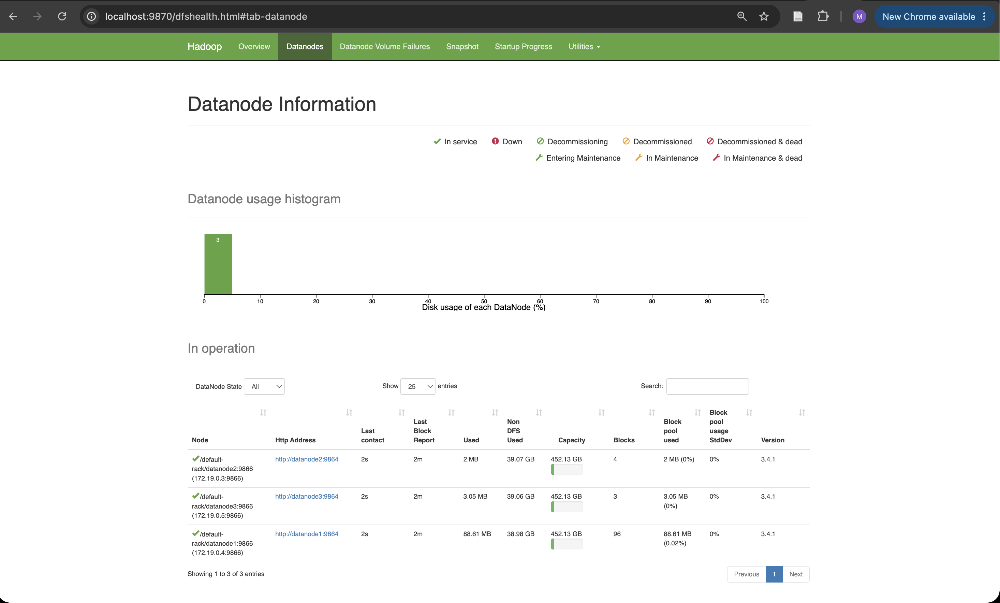
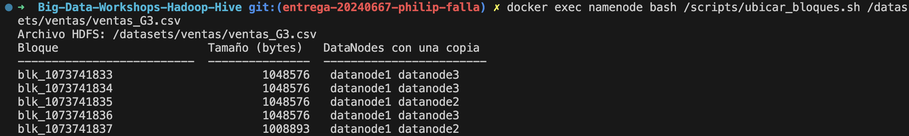
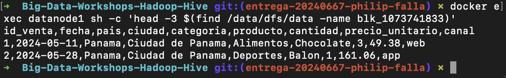
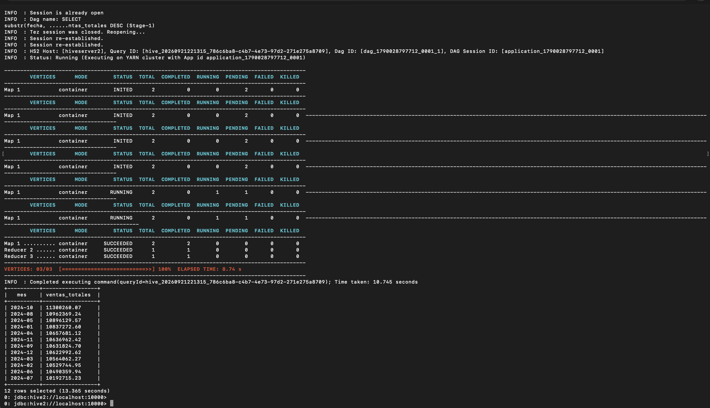
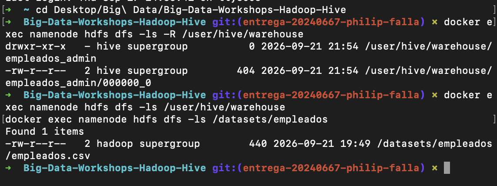
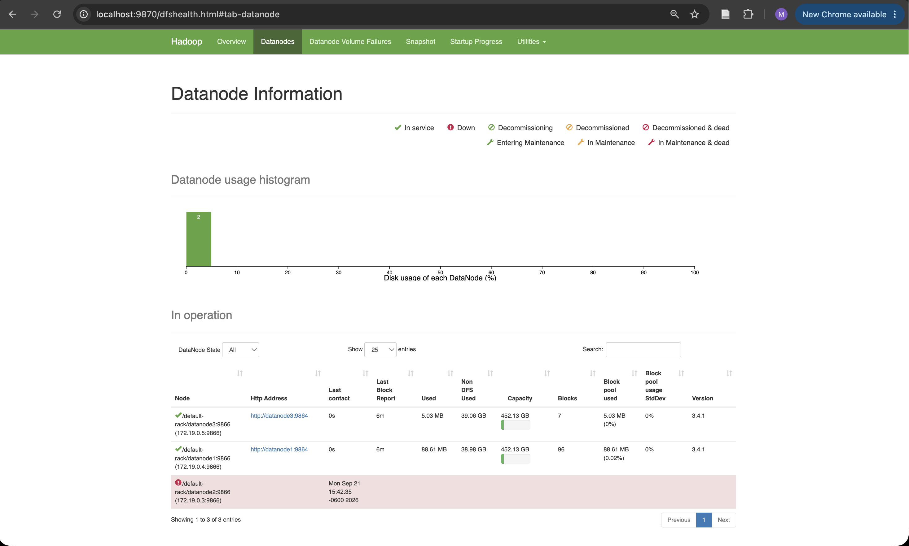

# Bitácora del taller Hadoop y Hive

- **Nombre:** Philip Falla
- **Carné:** 20240667
- **Grupo:** G3
- **Mini-reto asignado al grupo:** C
- **Sistema operativo y chip de tu laptop:** macOS, Apple M2

## 1. Evidencias

### E1. NameNode con 3 DataNodes vivos (Paso 10)



Lo que muestra: la interfaz web del NameNode (`localhost:9870`) reportando **Live Nodes: 3**, con `datanode1`,
`datanode2` y `datanode3` registrados tras escalar el clúster.

### E2. Ubicación de los bloques del archivo de mi grupo (Paso 10)



Lo que muestra: la salida de `ubicar_bloques.sh` para `ventas_G3.csv`: 5 bloques, cada uno con dos copias
repartidas entre `datanode1`, `datanode2` y `datanode3` (replicación = 2).

### E3. Un bloque físico dentro de un DataNode (Paso 4 o 10)

<!-- TODO: agregar entregas/G3/20240667-philip-falla/capturas/E3.png -->


Lo que muestra: `find` localizando el archivo `blk_1073741833` dentro del disco de `datanode1`, y `head`
mostrando sus primeras líneas: el encabezado y las primeras filas de `ventas_G3.csv` en texto plano.

### E4. Resultado de la consulta de negocio de mi grupo (Paso 8)

<!-- TODO: agregar entregas/G3/20240667-philip-falla/capturas/E4.png -->


Lo que muestra: el resultado en beeline del mini-reto C (ventas totales por mes), con octubre 2024 como el
mes de mayores ventas y julio 2024 como el más bajo.

### E5. Warehouse antes y después del `DROP` (Paso 9)



Lo que muestra: `hdfs dfs -ls` del warehouse de Hive antes del `DROP` (con la carpeta `empleados_admin` y su
archivo de datos) y después (vacía), junto con `/datasets/empleados` intacto tras borrar la tabla externa.

### E6. Clúster con un DataNode apagado (Paso 11)



Lo que muestra: el estado del clúster con un DataNode caído: la interfaz del NameNode marcándolo como nodo
muerto y la salida de `fsck` confirmando que el archivo sigue `HEALTHY` gracias a las réplicas en los nodos
vivos.

## 2. Preguntas de comprensión

**1. ¿Qué guarda el NameNode y qué guarda cada DataNode?** Justifícalo con lo que encontraste en `/data/dfs/name` y en `/data/dfs/data`.

El NameNode solo guarda el índice: en `/data/dfs/name/current` lo único que hay es `fsimage`, los `edits` y
`VERSION`, es decir, qué archivos existen, en qué bloques se dividen y en qué DataNode vive cada uno. Nunca
encontré un archivo `blk_*` ahí. En cambio, dentro de `datanode1`, en `/data/dfs/data/current/.../finalized/...`,
sí encontré los bloques reales (`blk_1073741833`, etc.) como archivos comunes con el contenido del CSV en texto
plano. El NameNode sabe *dónde* está cada byte; el DataNode es quien realmente lo tiene en su disco.

**2. Con tu salida de E2: ¿cuántos bloques tiene el archivo de tu grupo, en qué DataNodes está cada uno y por qué cada bloque aparece en dos nodos?**

`ventas_G3.csv` tiene 5 bloques (`blk_1073741833` a `blk_1073741837`). Están repartidos entre los tres
DataNodes: por ejemplo el primer bloque quedó en `datanode1` y `datanode3`, y otro en `datanode2` y
`datanode3`. Cada bloque aparece en exactamente dos nodos porque configuré `dfs.replication=2` después de
escalar a 3 DataNodes, así que el NameNode mantiene dos copias de cada bloque en nodos distintos por si uno
falla.

**3. ¿En qué se diferencia `hdfs dfs -ls /datasets` de `ls /datasets` dentro del contenedor? ¿Dónde están "de verdad" los bytes del archivo?**

`hdfs dfs -ls` le pregunta al NameNode qué hay en esa ruta *dentro de HDFS*, un sistema de archivos lógico que
no corresponde a ninguna carpeta real del contenedor. `ls /datasets` busca esa misma ruta en el disco local del
contenedor y falla con "No such file or directory", porque esa carpeta no existe ahí. Los bytes reales están
repartidos en los discos de los DataNodes, como archivos `blk_*` dentro de `/data/dfs/data`.

**4. ¿Qué pasó con los datos al hacer `DROP TABLE` de la tabla externa y qué pasó con los de la administrada? ¿Por qué esa diferencia importa cuando varios equipos comparten un Data Lake?**

Al borrar la tabla externa `empleados`, `hdfs dfs -ls /datasets/empleados` siguió mostrando `empleados.csv`
intacto: Hive solo borró su metadato (la definición de la tabla), nunca tocó el archivo. Al borrar la
administrada `empleados_admin`, en cambio, `/user/hive/warehouse` quedó vacío: esa carpeta era del propio
Hive, así que el `DROP` sí eliminó los datos. Esto importa en un Data Lake porque varios equipos y
herramientas (Hive, Spark, Trino) suelen leer los mismos archivos a través de tablas externas; si fueran
administradas, cualquier `DROP` de un equipo borraría los datos que otro equipo todavía necesita.

**5. Al apagar `datanode2`: ¿pudiste seguir leyendo tu archivo? ¿Qué hizo el NameNode después de ~1 minuto? Relaciónalo con la P del teorema CAP.**

Sí, pude seguir leyendo `ventas_G3.csv` sin error: como la replicación es 2, cada bloque que tenía copia en
`datanode2` también tenía otra copia en `datanode1` o `datanode3`, así que no se perdió ningún bloque. Después
de que pasó el intervalo configurado en `dfs.namenode.heartbeat.recheck-interval` (bajado a 10000 ms para el
taller, en vez de los 10 minutos por defecto), el NameNode dejó de recibir latidos de `datanode2` y lo marcó
como muerto en la interfaz web. Esto es la **P** de CAP en acción: el clúster tuvo una partición (un nodo dejó
de responder) y el sistema decidió seguir disponible para lecturas usando las réplicas restantes, en vez de
detenerse por completo.

**6. `WordCount.java` y la consulta de Hive dan el mismo resultado. ¿Qué gana y qué pierde un equipo que usa Hive en vez de escribir MapReduce a mano?**

Gana velocidad de desarrollo: la misma lógica que toma ~60 líneas de Java (mapper, reducer, tipos, configuración
del job) se escribe en una sola consulta SQL, y cualquiera que sepa SQL puede usarla sin entender Java ni la
API de MapReduce. Pierde control fino sobre el plan de ejecución: Hive decide por debajo cómo se convierte el
SQL en fases Map/Reduce (visible con `EXPLAIN`), así que si algo se ejecuta de forma ineficiente, hay menos
margen para ajustarlo a mano que si uno mismo escribiera el mapper y el reducer.

## 3. Mini-reto del grupo

**Pregunta de negocio (reto C):** Ventas totales por mes (`substr(fecha, 1, 7)`). ¿Cuál fue el mejor mes y cuál el peor?

**Consulta:**

```sql
SELECT substr(fecha, 1, 7) AS mes, ROUND(SUM(cantidad * precio_unitario), 2) AS total_ventas
FROM ventas
GROUP BY substr(fecha, 1, 7)
ORDER BY total_ventas DESC;
```

**Resultado (pega la tabla que devolvió beeline):**

```
+----------+-----------------+
|   mes    | ventas_totales  |
+----------+-----------------+
| 2024-10  | 11300260.07     |
| 2024-08  | 10962369.24     |
| 2024-05  | 10896129.57     |
| 2024-01  | 10837272.60     |
| 2024-04  | 10657681.12     |
| 2024-11  | 10636962.42     |
| 2024-09  | 10631824.70     |
| 2024-12  | 10622992.62     |
| 2024-03  | 10564062.27     |
| 2024-02  | 10529744.95     |
| 2024-06  | 10490359.94     |
| 2024-07  | 10192715.23     |
+----------+-----------------+
```

**Interpretación en una frase:** Octubre de 2024 fue el mejor mes (Q11,300,260.07) y julio el más bajo
(Q10,192,715.23), pero la diferencia entre ambos es de apenas ~10%, así que las ventas de mi grupo están
bastante distribuidas durante el año sin un pico estacional marcado.