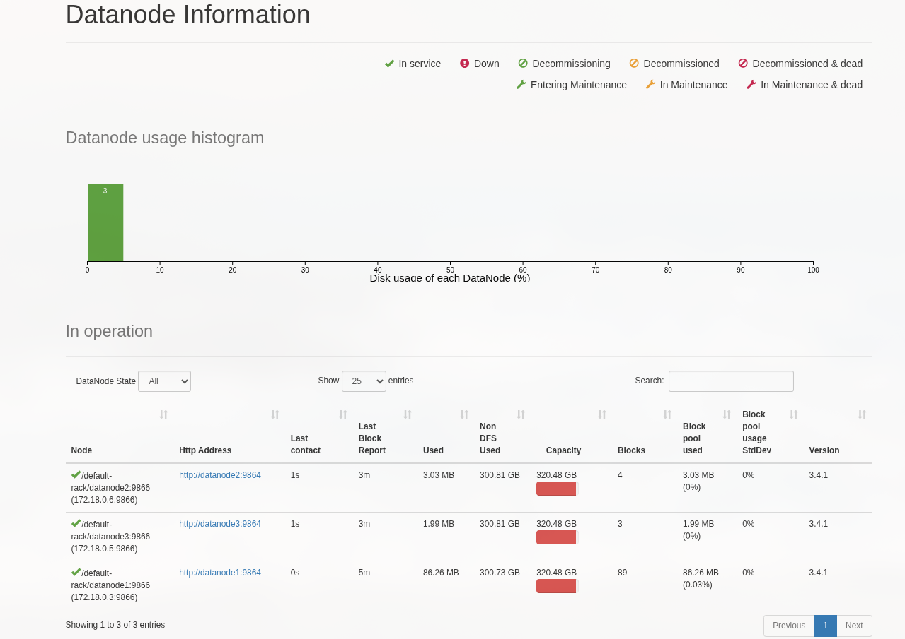
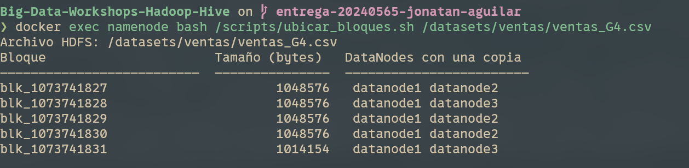
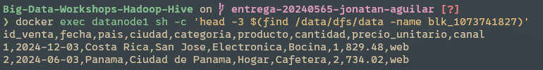
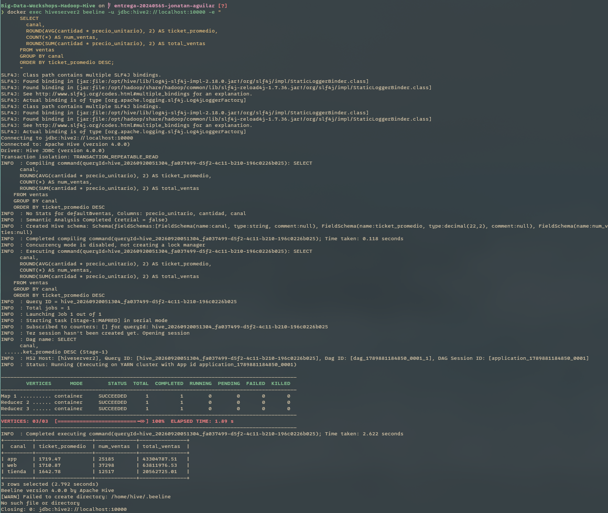
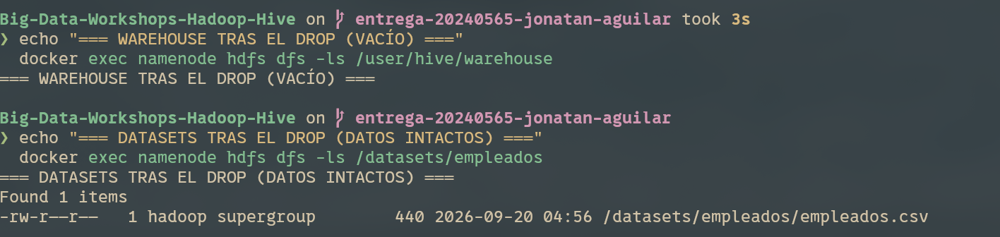
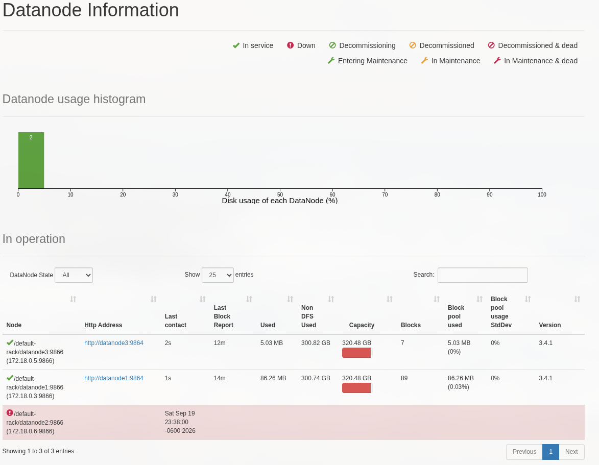

# Bitácora del taller Hadoop y Hive

- **Nombre:** Jonatan Aguilar
- **Carné:** 20240565
- **Grupo:** G4
- **Mini-reto asignado al grupo:** D
- **Sistema operativo y chip de tu laptop:** Arch Linux x86_64, Linux 7.2.3-arch1-2 (Docker 29.8.1 / Compose 5.5.1)

---

## 1. Evidencias

### E1. NameNode con 3 DataNodes vivos (Paso 10)



Lo que muestra: Interfaz web de administración del NameNode en `http://localhost:9870` confirmando el clúster con 3 DataNodes vivos y registrados (`datanode1`, `datanode2`, `datanode3`) tras el escalamiento horizontal.

---

### E2. Ubicación de los bloques del archivo de mi grupo (Paso 10)



Lo que muestra: Salida de `ubicar_bloques.sh` para el archivo `ventas_G4.csv`, demostrando que los 5 bloques generados tienen factor de replicación 2 y están repartidos de manera balanceada entre pares de DataNodes.

---

### E3. Un bloque físico dentro de un DataNode (Paso 4 o 10)



Lo que muestra: Búsqueda del archivo físico `blk_1073741827` en el almacenamiento local del contenedor `datanode1` (`/data/dfs/data`) e inspección de sus primeras filas con `head -3`, comprobando los datos de ventas sin procesar.

---

### E4. Resultado de la consulta de negocio de mi grupo (Paso 8)



Lo que muestra: Ejecución interactiva en Beeline de la consulta de agregación del Mini-reto D, mostrando el ticket promedio, conteo de órdenes y ventas totales agrupadas por canal (`app`, `web`, `tienda`).

---

### E5. Warehouse antes y después del `DROP` (Paso 9)



Lo que muestra: Comprobación en HDFS de que el comando `DROP TABLE` eliminó físicamente los archivos de la tabla administrada en `/user/hive/warehouse/`, mientras que los datos de la tabla externa en `/datasets/empleados/` se mantuvieron intactos en el clúster.

---

### E6. Clúster con un DataNode apagado (Paso 11)



Lo que muestra: Estado del clúster tras detener `datanode2`, donde el NameNode reporta 1 nodo muerto (`Dead Nodes: 1`, `Live Nodes: 2`) y la posterior verificación con `fsck` demostrando que HDFS restauró automáticamente las réplicas faltantes hacia `datanode3` manteniendo el sistema saludable.

---

## 2. Preguntas de comprensión

**1. ¿Qué guarda el NameNode y qué guarda cada DataNode? Justifícalo con lo que encontraste en `/data/dfs/name` y en `/data/dfs/data`.**  
El NameNode guarda únicamente los metadatos del clúster (`fsimage` y `edits` en `/data/dfs/name`): el catálogo de directorios, permisos, en cuántos bloques se divide cada archivo y en qué DataNodes se encuentra cada copia; no guarda ningún byte del contenido de los archivos. Los DataNodes almacenan en su disco local (`/data/dfs/data/.../finalized/`) los bloques físicos binarios o de texto plano (`blk_...`) y sus archivos de suma de verificación (`.meta`), transfiriendo los bloques a los clientes cuando se lo solicita el NameNode.

**2. Con tu salida de E2: ¿cuántos bloques tiene el archivo de tu grupo, en qué DataNodes está cada uno y por qué cada bloque aparece en dos nodos?**  
El archivo `ventas_G4.csv` (~5.2 MB) se divide en 5 bloques: 4 bloques completos de 1 MB (1,048,576 bytes) y 1 bloque final con el sobrante (1,014,154 bytes). Cada bloque aparece en dos nodos porque se aplicó un factor de replicación `dfs.replication = 2`. Cada bloque conserva su réplica original en `datanode1` y su segunda réplica distribuida entre `datanode2` (bloques 0, 2 y 3) y `datanode3` (bloques 1 y 4), logrando redundancia sin duplicar en todos los nodos.

**3. ¿En qué se diferencia `hdfs dfs -ls /datasets` de `ls /datasets` dentro del contenedor? ¿Dónde están "de verdad" los bytes del archivo?**  
`hdfs dfs -ls /datasets` consulta el espacio de nombres virtual y distribuido administrado por el NameNode. Por el contrario, `ls /datasets` busca una ruta en el sistema de archivos local del contenedor Linux, fallando con error porque dicha carpeta no existe físicamente en el contenedor. Los bytes del archivo residen físicamente repartidos en pedazos de 1 MB dentro de los volúmenes de disco de los DataNodes (`/data/dfs/data/.../blk_...`).

**4. ¿Qué pasó con los datos al hacer `DROP TABLE` de la tabla externa y qué pasó con los de la administrada? ¿Por qué esa diferencia importa cuando varios equipos comparten un Data Lake?**  
Al ejecutar `DROP TABLE` de la tabla administrada (`empleados_admin`), Hive eliminó tanto los metadatos como el directorio y los archivos físicos en HDFS (`/user/hive/warehouse`). Con la tabla externa (`empleados`), Hive únicamente borró el registro de su catálogo y dejó el archivo CSV original en `/datasets/empleados/` intacto. En un Data Lake compartido por múltiples equipos y herramientas (Hive, Spark, Trino), las tablas externas son indispensables porque garantizan que una consulta o borrado accidental de un equipo no destruya la fuente de datos común.

**5. Al apagar `datanode2`: ¿pudiste seguir leyendo tu archivo? ¿Qué hizo el NameNode después de ~1 minuto? Relaciónalo con la P del teorema CAP.**  
Sí, el archivo se pudo leer inmediatamente y sin errores (75,058 líneas) porque el cliente solicitó los bloques alternativos a `datanode1` y `datanode3`. Tras ~50 segundos sin recibir latidos (*heartbeats*), el NameNode declaró a `datanode2` como nodo muerto y ordenó copiar automáticamente los bloques huérfanos a `datanode3`, recuperando la replicación de 2. Esto demuestra la Tolerancia a Particiones (P) combinada con Alta Disponibilidad (A): ante una partición o falla de hardware en un nodo, el clúster sigue operativo y autorepara la redundancia.

**6. `WordCount.java` y la consulta de Hive dan el mismo resultado. ¿Qué gana y qué pierde un equipo que usa Hive en vez de escribir MapReduce a mano?**  
El equipo gana agilidad extrema, alta productividad y accesibilidad, ya que permite a cualquier usuario que conozca SQL consultar petabytes de datos en segundos sin escribir decenas de líneas de código Java, sin lidiar con serialización de tipos ni compilar archivos JAR. Se pierde el control fino de bajo nivel sobre optimizaciones extremas de memoria, pipelines de ejecución no estándar o algoritmos de grafos/machine learning complejos que no se expresan de forma natural en álgebra relacional.

---

## 3. Mini-reto del grupo

**Pregunta de negocio (reto D):**  
Ticket promedio por canal (`tienda`, `web`, `app`) y número de ventas por canal. ¿Qué canal tiene el ticket más alto?

**Consulta:**

```sql
SELECT
  canal,
  ROUND(AVG(cantidad * precio_unitario), 2) AS ticket_promedio,
  COUNT(*) AS num_ventas,
  ROUND(SUM(cantidad * precio_unitario), 2) AS total_ventas
FROM ventas
GROUP BY canal
ORDER BY ticket_promedio DESC;
```

**Resultado (pega la tabla que devolvió beeline):**

```text
+---------+------------------+-------------+---------------+
|  canal  | ticket_promedio  | num_ventas  | total_ventas  |
+---------+------------------+-------------+---------------+
| app     | 1719.47          | 25185       | 43304787.51   |
| web     | 1710.87          | 37298       | 63811976.53   |
| tienda  | 1642.78          | 12517       | 20562725.01   |
+---------+------------------+-------------+---------------+
```

**Interpretación en una frase:**  
El canal con el ticket promedio más alto es **app** con **1,719.47**, seguido de cerca por **web** (1,710.87) y **tienda** (1,642.78); sin embargo, el canal **web** es el canal principal de negocio al concentrar la mayor cantidad de compras (37,298 transacciones) y la mayor facturación global.

---

## 4. Problemas que tuve y cómo los resolví (opcional)

- **Permisos en socket Docker:** En entornos Linux el usuario requería pertenecer al grupo `docker` para interactuar con el socket sin elevación permanente.
- **Permisos de directorio `/tmp/hive` en HDFS:** Al levantar HiveServer2 se requirió asegurar permisos de escritura `777` en los directorios HDFS `/tmp` y `/user/hive` para permitir que el usuario de servicio `hive` pudiera inicializar sus directorios de sesión sin conflictos de autorización.
