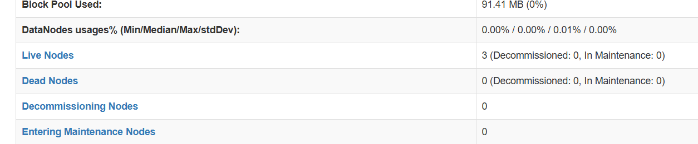
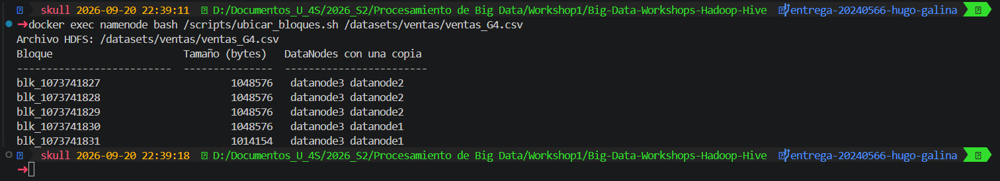
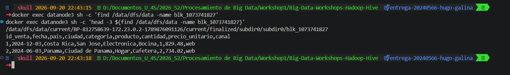
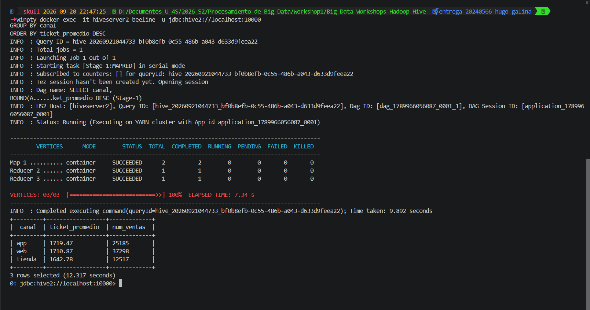
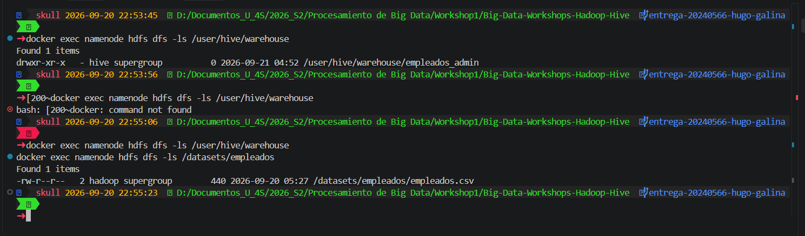
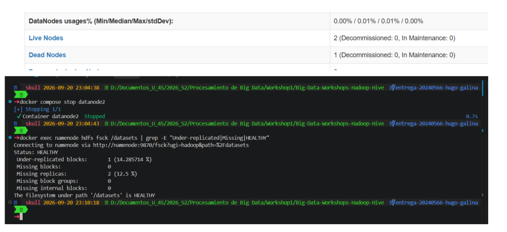

# Bitácora del taller Hadoop y Hive

- **Nombre: Hugo Jonathan Daniel Galina Puac**
- **Carné: 20240566**
- **Grupo: G#4** 
- **Mini-reto asignado al grupo:** D
- **Sistema operativo y chip de tu laptop:** Windows 11, Intel

## 1. Evidencias

### E1. NameNode con 3 DataNodes vivos (Paso 10)



Lo que muestra: Muestra los 3 nodos de informaicon (Datanode1-3) funcionando y estando activos.

### E2. Ubicación de los bloques del archivo de mi grupo (Paso 10)



Lo que muestra: Lo que muestra: La imagen muestra la salida de ubicar_bloques.sh para ventas_G4.csv: el archivo tiene 5 bloques (4 de 1 MB
y uno final de ~1 MB con el resto de las filas), y cada bloque está replicado en exactamente 2 de los 3
DataNodes del clúster — ninguno aparece en los tres nodos ni en uno solo, confirmando el factor de
replicación 2 configurado en el Paso 10.

### E3. Un bloque físico dentro de un DataNode (Paso 4 o 10)



Lo que muestra: El bloque blk_1073741827 aparece como archivo físico dentro del disco de datanode3, en la ruta interna
que HDFS usa para bloques finalizados (finalized/subdir0/subdir0/). El head confirma que es texto plano
sin formato especial: el encabezado del CSV y las dos primeras filas reales de ventas.


### E4. Resultado de la consulta de negocio de mi grupo (Paso 8)



Lo que muestra: Resultado de la consulta del mini-reto D (ticket promedio por canal): "app" tiene el ticket promedio más
alto (Q1,719.47) aunque es el canal con menos ventas en volumen; "web" concentra la mayor cantidad de
transacciones (37,298) con un ticket casi igual de alto; "tienda" tiene el ticket promedio más bajo.

### E5. Warehouse antes y después del `DROP` (Paso 9)



Lo que muestra: Antes del DROP, /user/hive/warehouse contiene la carpeta empleados_admin con su archivo de datos. Después
de hacer DROP TABLE a ambas tablas, el warehouse queda vacío (Hive borró los datos que él mismo poseía),
pero /datasets/empleados/empleados.csv sigue intacto: la tabla externa nunca le dio a Hive autoridad sobre
el archivo fuente.

### E6. Clúster con un DataNode apagado (Paso 11)



Lo que muestra: Con datanode2 apagado, la interfaz web del NameNode muestra Live Nodes: 2 y Dead Nodes: 1, confirmando que
el NameNode detectó la caída tras el intervalo configurado (~50 segundos). El fsck muestra bloques
under-replicated mientras el sistema se autorepara, volviendo a HEALTHY una vez que las copias faltantes
se reconstruyen en el nodo restante.

## 2. Preguntas de comprensión

**1. ¿Qué guarda el NameNode y qué guarda cada DataNode?** Justifícalo con lo que encontraste en `/data/dfs/name` y en `/data/dfs/data`.

El NameNode guarda únicamente el catálogo: qué archivos existen, en qué bloques se dividen y en qué DataNodes está cada uno. Lo confirmé revisando /data/dfs/name/current dentro del contenedor namenode, donde solo hay fsimage (una foto del árbol de archivos) y edits (el registro de cambios) — ni un solo byte de datos reales. En cambio, dentro de /data/dfs/data en los DataNodes encontré los bloques físicos (blk_...) como archivos comunes de texto plano, con el contenido real del CSV.

**2. Con tu salida de E2: ¿cuántos bloques tiene el archivo de tu grupo, en qué DataNodes está cada uno y por qué cada bloque aparece en dos nodos?**

El archivo ventas_G4.csv tiene 5 bloques: cuatro de 1,048,576 bytes (1 MB exacto) y uno final de 1,014,154 bytes con el resto de las filas. Cada bloque aparece en exactamente dos de los tres DataNodes (por ejemplo, blk_1073741827 en datanode2 y datanode3), porque configuré dfs.replication=2 en el Paso 10: HDFS mantiene dos copias de cada bloque para poder perder un nodo sin perder datos, sin llegar a tener el archivo completo repetido en los tres.

**3. ¿En qué se diferencia `hdfs dfs -ls /datasets` de `ls /datasets` dentro del contenedor? ¿Dónde están "de verdad" los bytes del archivo?**

hdfs dfs -ls /datasets le pregunta al NameNode por una ruta que solo existe en su catálogo interno de HDFS; ls /datasets (sin hdfs dfs) le pregunta al sistema operativo normal del contenedor, donde esa carpeta no existe y da error. Los bytes reales del archivo nunca están en una sola ubicación "completa" — viven repartidos en fragmentos (bloques) dentro de los discos de los DataNodes; el NameNode solo sabe cómo reconstruir el archivo a partir de esas piezas.

**4. ¿Qué pasó con los datos al hacer `DROP TABLE` de la tabla externa y qué pasó con los de la administrada? ¿Por qué esa diferencia importa cuando varios equipos comparten un Data Lake?**

Al hacer DROP TABLE de la tabla administrada (empleados_admin), Hive borró también el archivo físico en /user/hive/warehouse, porque esa tabla era responsabilidad exclusiva de Hive. Al hacer DROP TABLE de la tabla externa (empleados), solo se borró el registro en el catálogo de Hive: el archivo empleados.csv siguió intacto en /datasets/empleados/. Esto importa en un Data Lake porque varios equipos pueden usar los mismos datos crudos con herramientas distintas; si una tabla externa de un equipo se borra por error, no arrastra los datos que otro equipo todavía necesita.

**5. Al apagar `datanode2`: ¿pudiste seguir leyendo tu archivo? ¿Qué hizo el NameNode después de ~1 minuto? Relaciónalo con la P del teorema CAP.**

Sí pude seguir leyendo el archivo completo de inmediato después de apagar datanode2: el cliente simplemente usó la otra copia de cada bloque afectado, sin que yo notara nada. Después de aproximadamente un minuto, el NameNode dejó de recibir los "latidos" de datanode2, lo marcó como muerto (Dead datanodes (1)) y empezó a copiar automáticamente los bloques que se quedaron con una sola réplica hacia el nodo restante. Esto es la P de CAP en acción: el sistema priorizó seguir disponible durante la partición (nodo caído) en vez de detenerse a esperar consistencia total.

**6. `WordCount.java` y la consulta de Hive dan el mismo resultado. ¿Qué gana y qué pierde un equipo que usa Hive en vez de escribir MapReduce a mano?**

Hive gana simplicidad: la misma pregunta que en WordCount.java tomó ~60 líneas de Java (definir mapper, reducer, tipos de Hadoop) se resolvió con una sola consulta SQL, y ambos dieron exactamente el mismo resultado porque Hive traduce el GROUP BY internamente en las mismas fases Map y Reduce (lo confirmé con EXPLAIN, viendo Reducer 2 <- Map 1). Lo que se pierde es control fino: con Java se puede optimizar o personalizar cada paso del procesamiento, mientras que con Hive uno depende del plan que el motor decide generar.

## 3. Mini-reto del grupo

**Pregunta de negocio (reto D):** Ticket promedio por canal (tienda, web, app) y número de ventas por canal. ¿Qué canal tiene el ticket más alto?

**Consulta:** 

```sql
    SELECT canal,
       ROUND(AVG(cantidad * precio_unitario), 2) AS ticket_promedio,
       COUNT(*) AS num_ventas
    FROM ventas
    GROUP BY canal
    ORDER BY ticket_promedio DESC;
```

**Resultado (pega la tabla que devolvió beeline):**

```
+---------+------------------+-------------+
|  canal  | ticket_promedio  | num_ventas  |
+---------+------------------+-------------+
| app     | 1719.47          | 25185       |
| web     | 1710.87          | 37298       |
| tienda  | 1642.78          | 12517       |
+---------+------------------+-------------+
```
**Interpretacion en una frase:**
El canal "app" tiene el ticket promedio más alto (Q1,719.47), aunque es el canal con menos ventas en volumen "web" es el que más transacciones concentra.

## 4. Problemas que tuve y cómo los resolví (opcional)

Al configurar core-site.xml y hdfs-site.xml (Paso 2), copié el bloque XML del README literalmente y usé
la etiqueta <n> en vez de <name> para cada propiedad — un error de transcripción del propio documento del
taller. Hadoop ignoró silenciosamente la configuración (fs.defaultFS quedó en su valor por defecto,
file:///), y el NameNode falló al arrancar con "Invalid URI for NameNode address". Lo detecté revisando
docker compose logs namenode, donde la línea "fs.defaultFS is file:///" reveló que la propiedad nunca se
leyó. Se corrigió reemplazando <n> por <name> en ambos archivos.

Al agregar HiveServer2 (Paso 6), el contenedor tardaba varios minutos en conectar, con "Connection
refused" repetido. La causa real (no visible en docker compose logs, que no mostraba nada útil por falta
de log4j.properties) era doble: las carpetas /tmp/hive y /user/hive/warehouse en HDFS no eran escribibles
para el usuario interno de Hive (permisos por defecto rwxr-xr-x), y varios reinicios con "docker compose
restart" dejaron procesos previos colgados, generando "HiveServer2 running as process 7". Se resolvió
dando permisos amplios con hdfs dfs -chmod -R 777 a esas carpetas, y recreando el contenedor por completo
(docker compose rm -f + up -d) en vez de reiniciarlo. El log real (dentro del contenedor, en
/tmp/hive/hive.log) confirmó el arranque exitoso una vez corregido.